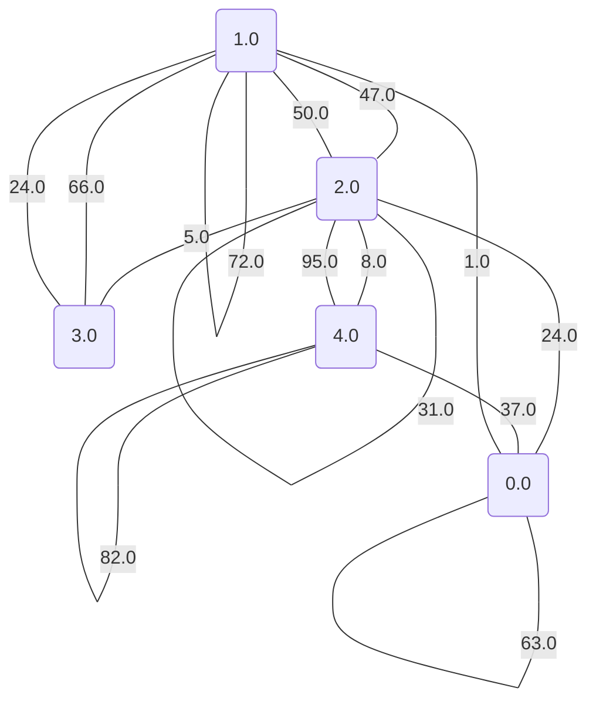

```mermaid
graph TD;
	0("0.0");
	1("1.0");
	2("2.0");
	3("3.0");
	4("4.0");
	2 -- "24.0" --- 0;
	1 -- "72.0" --- 1;
	2 -- "8.0" --- 4;
	4 -- "37.0" --- 0;
	3 -- "66.0" --- 1;
	2 -- "50.0" --- 1;
	4 -- "59.0" --- 4;
	3 -- "24.0" --- 1;
	2 -- "5.0" --- 3;
	0 -- "63.0" --- 0;
	4 -- "82.0" --- 4;
	2 -- "31.0" --- 2;
	2 -- "95.0" --- 4;
	1 -- "47.0" --- 2;
	1 -- "1.0" --- 0;
```

