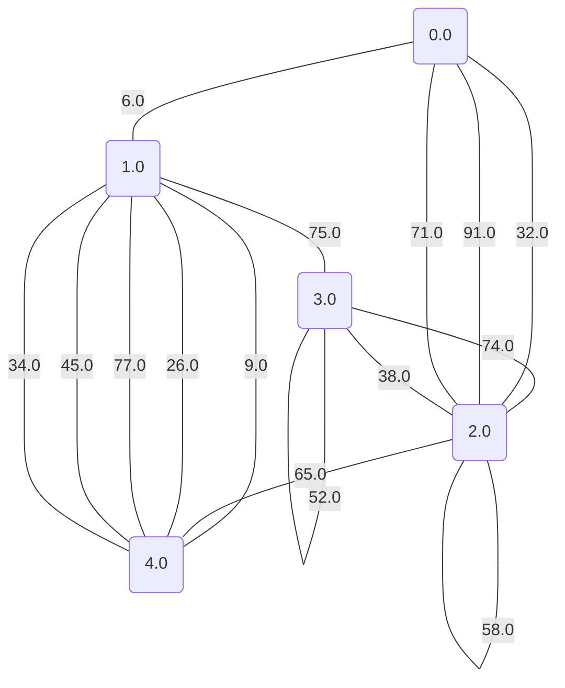

```mermaid
graph TD;
	0("0.0");
	1("1.0");
	2("2.0");
	3("3.0");
	4("4.0");
	4 -- "77.0" --- 1;
	2 -- "91.0" --- 0;
	2 -- "71.0" --- 0;
	1 -- "9.0" --- 4;
	3 -- "52.0" --- 3;
	4 -- "45.0" --- 1;
	3 -- "74.0" --- 2;
	1 -- "75.0" --- 3;
	2 -- "65.0" --- 4;
	0 -- "6.0" --- 1;
	0 -- "32.0" --- 2;
	4 -- "34.0" --- 1;
	1 -- "26.0" --- 4;
	2 -- "38.0" --- 3;
	2 -- "58.0" --- 2;
```

