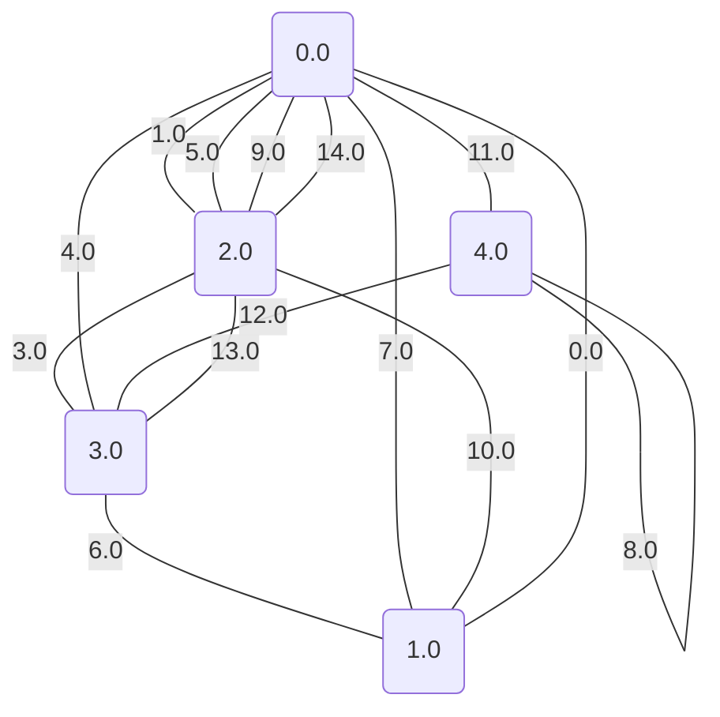

```mermaid
graph TD;
0("0.0");
1("1.0");
2("2.0");
3("3.0");
4("4.0");
	1 -- "0.0" --- 0;
	0 -- "1.0" --- 2;
	4 -- "2.0" --- 4;
	2 -- "3.0" --- 3;
	0 -- "4.0" --- 3;
	2 -- "5.0" --- 0;
	3 -- "6.0" --- 1;
	0 -- "7.0" --- 1;
	4 -- "8.0" --- 4;
	2 -- "9.0" --- 0;
	2 -- "10.0" --- 1;
	0 -- "11.0" --- 4;
	4 -- "12.0" --- 3;
	3 -- "13.0" --- 2;
	2 -- "14.0" --- 0;
```
