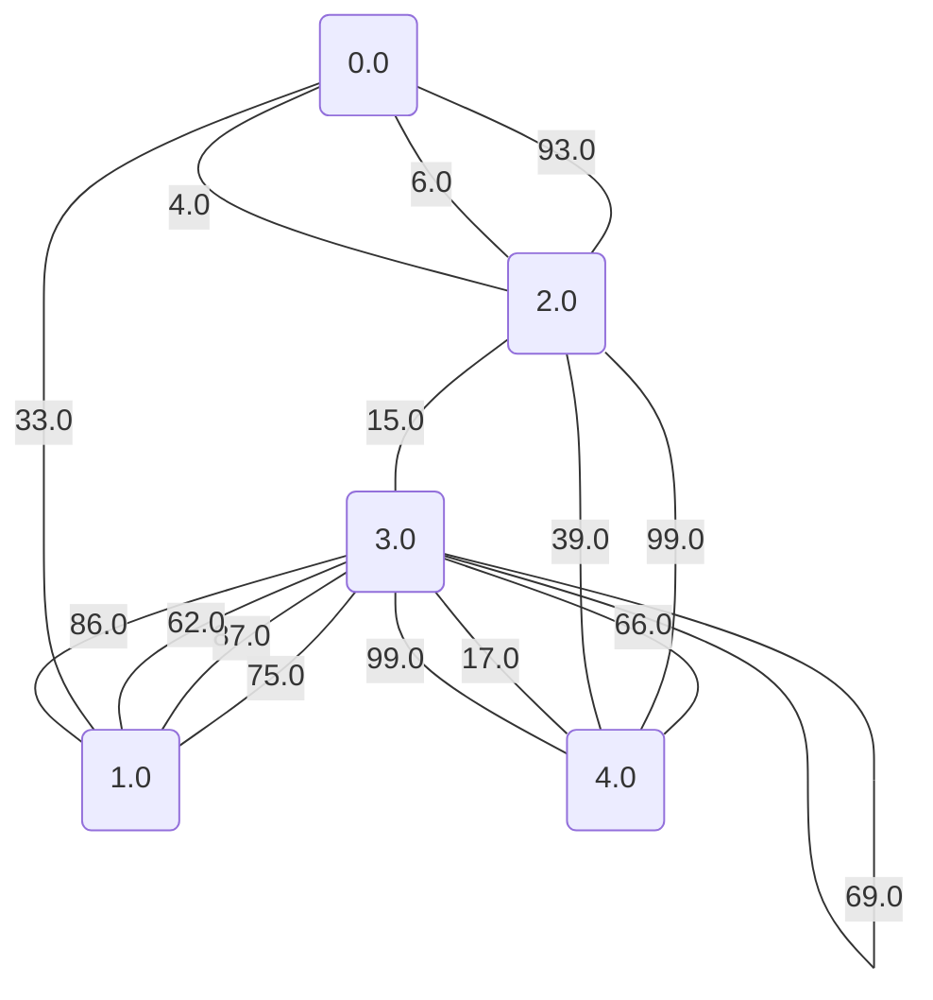

```mermaid
graph TD;
	0("0.0");
	1("1.0");
	2("2.0");
	3("3.0");
	4("4.0");
	4 -- "39.0" --- 2;
	3 -- "69.0" --- 3;
	2 -- "4.0" --- 0;
	2 -- "15.0" --- 3;
	1 -- "87.0" --- 3;
	3 -- "66.0" --- 4;
	4 -- "17.0" --- 3;
	1 -- "62.0" --- 3;
	2 -- "99.0" --- 4;
	0 -- "93.0" --- 2;
	1 -- "33.0" --- 0;
	3 -- "75.0" --- 1;
	1 -- "86.0" --- 3;
	4 -- "99.0" --- 3;
	0 -- "6.0" --- 2;
```

