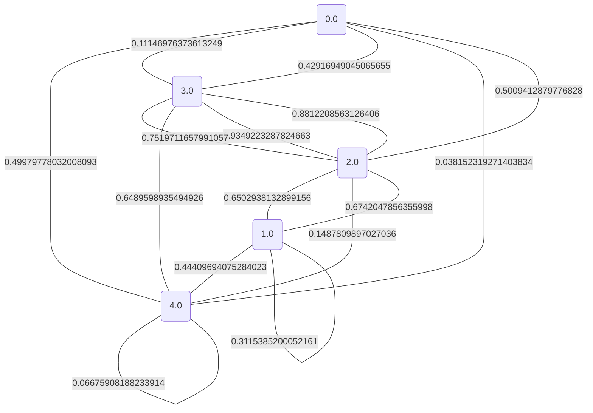

```mermaid
graph TD;
	0("0.0");
	1("1.0");
	2("2.0");
	3("3.0");
	4("4.0");
	0 -- "0.49979778032008093" --- 4;
	0 -- "0.11146976373613249" --- 3;
	2 -- "0.6502938132899156" --- 1;
	2 -- "0.9349223287824663" --- 3;
	2 -- "0.5009412879776828" --- 0;
	3 -- "0.7519711657991057" --- 2;
	2 -- "0.8812208563126406" --- 3;
	2 -- "0.1487809897027036" --- 4;
	4 -- "0.06675908188233914" --- 4;
	1 -- "0.44409694075284023" --- 4;
	2 -- "0.6742047856355998" --- 1;
	4 -- "0.038152319271403834" --- 0;
	3 -- "0.6489598935494926" --- 4;
	1 -- "0.3115385200052161" --- 1;
	0 -- "0.42916949045065655" --- 3;
```

