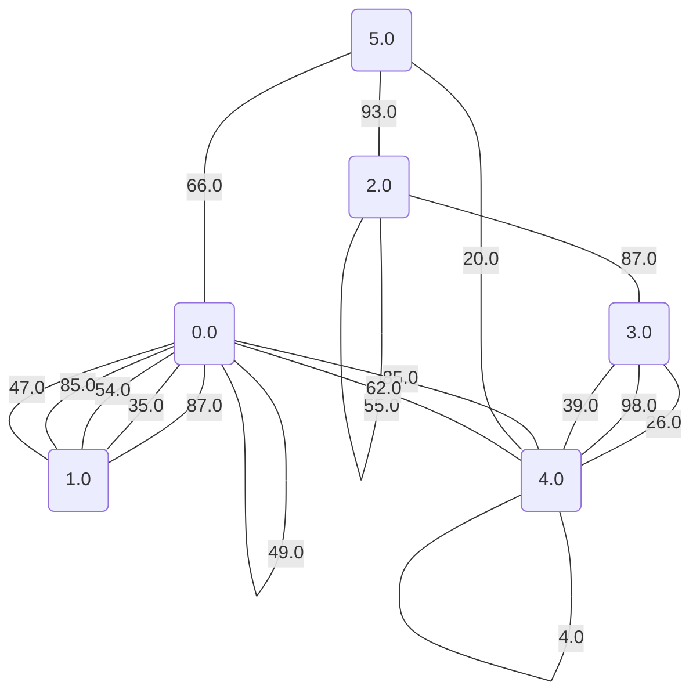

```mermaid
graph TD;
	0("0.0");
	1("1.0");
	2("2.0");
	3("3.0");
	4("4.0");
	5("5.0");
	3 -- "26.0" --- 4;
	0 -- "49.0" --- 0;
	2 -- "87.0" --- 3;
	5 -- "66.0" --- 0;
	0 -- "87.0" --- 1;
	4 -- "4.0" --- 4;
	3 -- "98.0" --- 4;
	3 -- "39.0" --- 4;
	0 -- "85.0" --- 4;
	5 -- "93.0" --- 2;
	1 -- "35.0" --- 0;
	1 -- "54.0" --- 0;
	1 -- "85.0" --- 0;
	2 -- "39.0" --- 2;
	2 -- "55.0" --- 2;
	5 -- "20.0" --- 4;
	0 -- "62.0" --- 4;
	1 -- "47.0" --- 0;
```

