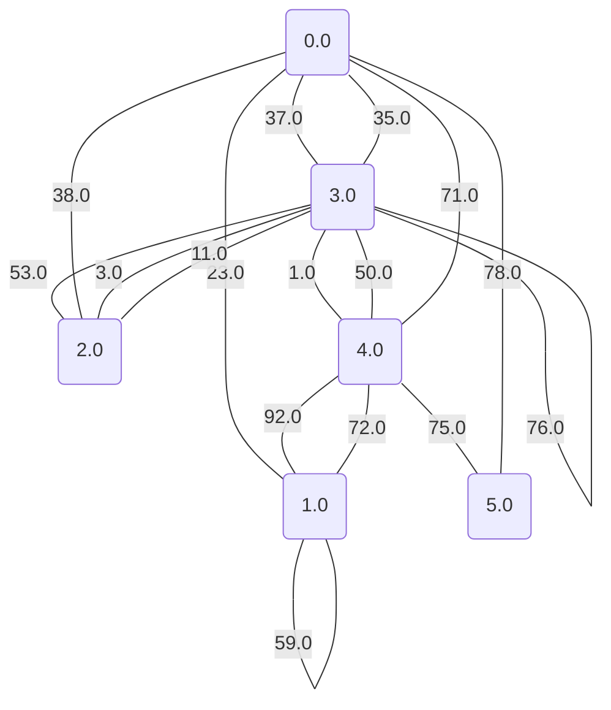

```mermaid
graph TD;
	0("0.0");
	1("1.0");
	2("2.0");
	3("3.0");
	4("4.0");
	5("5.0");
	2 -- "38.0" --- 0;
	4 -- "75.0" --- 5;
	0 -- "37.0" --- 3;
	3 -- "1.0" --- 4;
	3 -- "53.0" --- 2;
	2 -- "3.0" --- 3;
	3 -- "92.0" --- 3;
	0 -- "23.0" --- 1;
	2 -- "11.0" --- 3;
	3 -- "50.0" --- 4;
	4 -- "71.0" --- 0;
	1 -- "72.0" --- 4;
	1 -- "59.0" --- 1;
	3 -- "40.0" --- 3;
	3 -- "35.0" --- 0;
	5 -- "78.0" --- 0;
	4 -- "92.0" --- 1;
	3 -- "76.0" --- 3;
```

