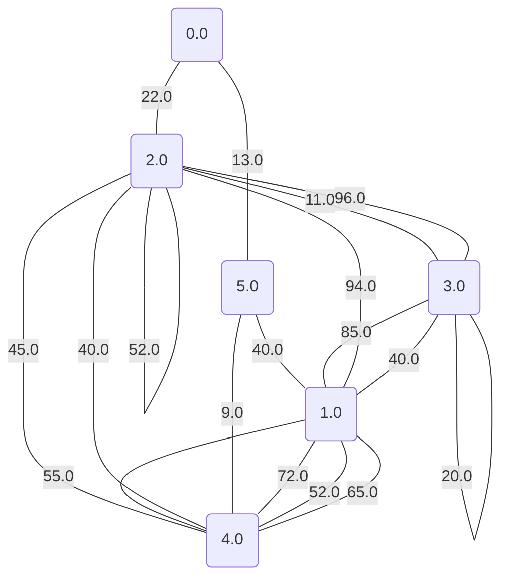

```mermaid
graph TD;
	0("0.0");
	1("1.0");
	2("2.0");
	3("3.0");
	4("4.0");
	5("5.0");
	2 -- "11.0" --- 3;
	2 -- "45.0" --- 4;
	4 -- "72.0" --- 1;
	4 -- "52.0" --- 1;
	5 -- "40.0" --- 1;
	1 -- "55.0" --- 4;
	1 -- "40.0" --- 3;
	3 -- "46.0" --- 3;
	2 -- "96.0" --- 3;
	2 -- "40.0" --- 4;
	0 -- "22.0" --- 2;
	3 -- "85.0" --- 1;
	0 -- "13.0" --- 5;
	4 -- "65.0" --- 1;
	2 -- "52.0" --- 2;
	5 -- "9.0" --- 4;
	2 -- "94.0" --- 1;
	3 -- "20.0" --- 3;
```

