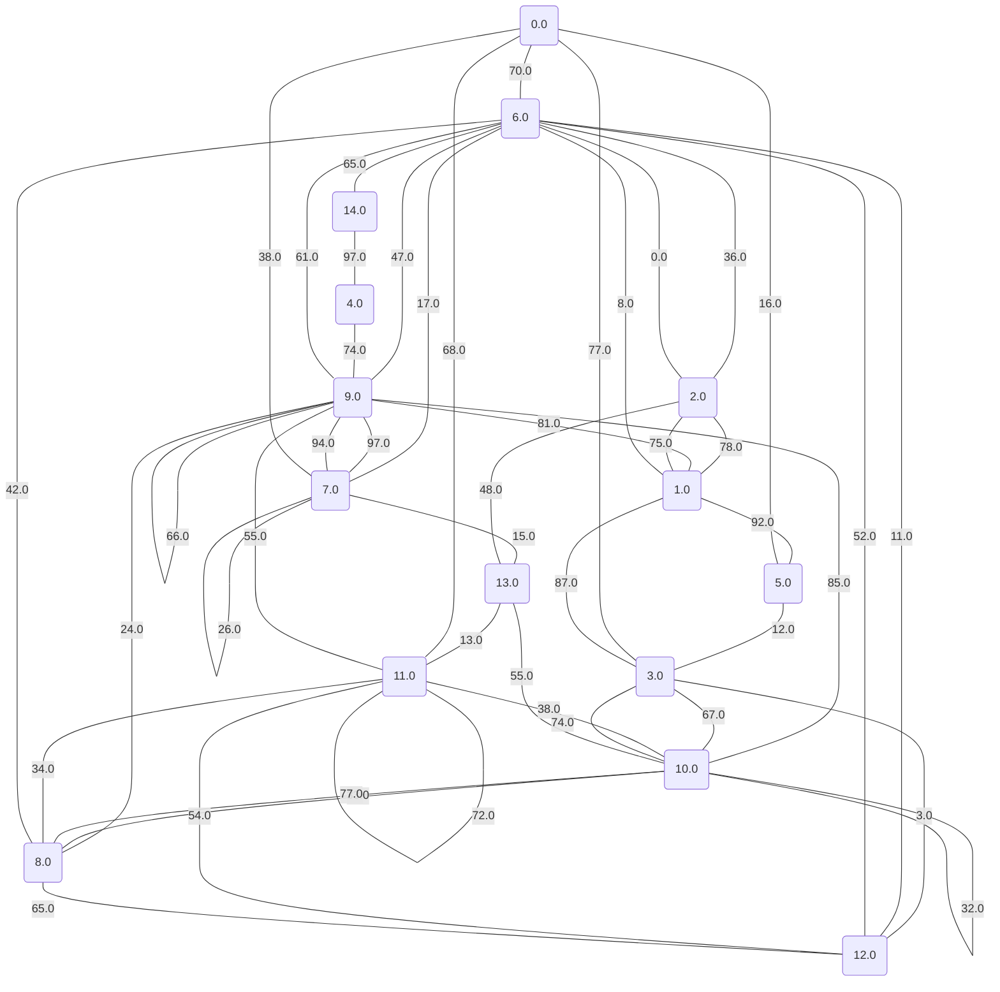

```mermaid
graph TD;
	0("0.0");
	1("1.0");
	2("2.0");
	3("3.0");
	4("4.0");
	5("5.0");
	6("6.0");
	7("7.0");
	8("8.0");
	9("9.0");
	10("10.0");
	11("11.0");
	12("12.0");
	13("13.0");
	14("14.0");
	0 -- "70.0" --- 6;
	11 -- "68.0" --- 0;
	9 -- "66.0" --- 9;
	3 -- "3.0" --- 12;
	6 -- "11.0" --- 12;
	3 -- "77.0" --- 0;
	5 -- "12.0" --- 3;
	6 -- "47.0" --- 9;
	9 -- "85.0" --- 10;
	9 -- "24.0" --- 8;
	4 -- "74.0" --- 9;
	6 -- "61.0" --- 9;
	6 -- "52.0" --- 12;
	10 -- "32.0" --- 10;
	2 -- "78.0" --- 1;
	6 -- "36.0" --- 2;
	1 -- "92.0" --- 5;
	3 -- "67.0" --- 10;
	8 -- "42.0" --- 6;
	14 -- "97.0" --- 4;
	6 -- "65.0" --- 14;
	6 -- "17.0" --- 7;
	13 -- "13.0" --- 11;
	10 -- "33.0" --- 8;
	9 -- "81.0" --- 1;
	1 -- "8.0" --- 6;
	7 -- "94.0" --- 9;
	11 -- "38.0" --- 10;
	11 -- "55.0" --- 9;
	7 -- "15.0" --- 13;
	5 -- "16.0" --- 0;
	7 -- "38.0" --- 0;
	3 -- "74.0" --- 10;
	9 -- "97.0" --- 7;
	13 -- "55.0" --- 10;
	10 -- "77.0" --- 8;
	11 -- "72.0" --- 11;
	3 -- "87.0" --- 1;
	11 -- "54.0" --- 12;
	2 -- "48.0" --- 13;
	8 -- "65.0" --- 12;
	7 -- "26.0" --- 7;
	11 -- "34.0" --- 8;
	2 -- "75.0" --- 1;
	6 -- "0.0" --- 2;
```

