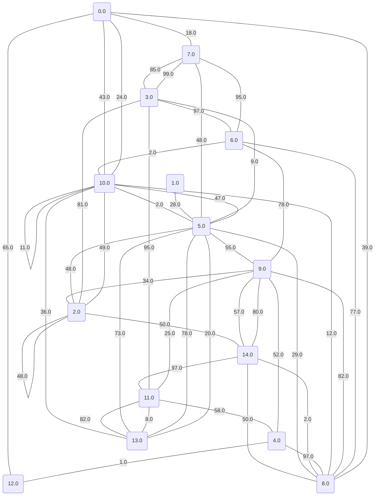

```mermaid
graph TD;
	0("0.0");
	1("1.0");
	2("2.0");
	3("3.0");
	4("4.0");
	5("5.0");
	6("6.0");
	7("7.0");
	8("8.0");
	9("9.0");
	10("10.0");
	11("11.0");
	12("12.0");
	13("13.0");
	14("14.0");
	6 -- "2.0" --- 10;
	14 -- "97.0" --- 11;
	10 -- "2.0" --- 5;
	11 -- "58.0" --- 4;
	8 -- "82.0" --- 9;
	13 -- "73.0" --- 5;
	0 -- "65.0" --- 12;
	7 -- "85.0" --- 3;
	5 -- "48.0" --- 7;
	10 -- "11.0" --- 10;
	2 -- "50.0" --- 14;
	7 -- "99.0" --- 3;
	10 -- "43.0" --- 0;
	14 -- "50.0" --- 8;
	11 -- "25.0" --- 9;
	9 -- "34.0" --- 2;
	10 -- "36.0" --- 13;
	5 -- "9.0" --- 3;
	13 -- "8.0" --- 11;
	8 -- "77.0" --- 6;
	13 -- "78.0" --- 5;
	5 -- "47.0" --- 10;
	13 -- "20.0" --- 5;
	1 -- "28.0" --- 5;
	5 -- "55.0" --- 9;
	11 -- "82.0" --- 13;
	5 -- "29.0" --- 8;
	10 -- "24.0" --- 0;
	8 -- "39.0" --- 0;
	6 -- "78.0" --- 9;
	3 -- "97.0" --- 6;
	3 -- "95.0" --- 11;
	5 -- "48.0" --- 2;
	14 -- "2.0" --- 8;
	6 -- "95.0" --- 7;
	2 -- "48.0" --- 2;
	0 -- "18.0" --- 7;
	9 -- "57.0" --- 14;
	4 -- "1.0" --- 12;
	9 -- "52.0" --- 4;
	2 -- "81.0" --- 3;
	2 -- "49.0" --- 10;
	9 -- "80.0" --- 14;
	4 -- "97.0" --- 8;
	10 -- "12.0" --- 8;
```

