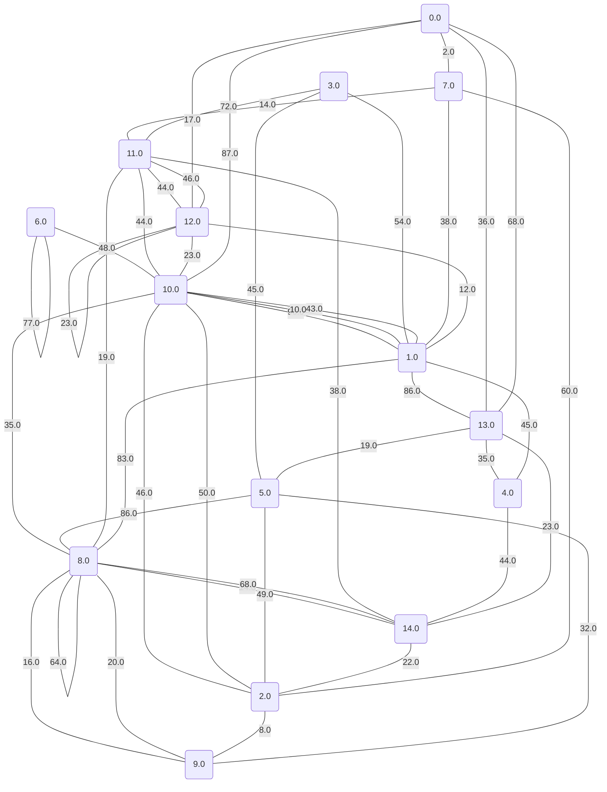

```mermaid
graph TD;
	0("0.0");
	1("1.0");
	2("2.0");
	3("3.0");
	4("4.0");
	5("5.0");
	6("6.0");
	7("7.0");
	8("8.0");
	9("9.0");
	10("10.0");
	11("11.0");
	12("12.0");
	13("13.0");
	14("14.0");
	8 -- "14.0" --- 14;
	8 -- "16.0" --- 9;
	10 -- "96.0" --- 1;
	4 -- "45.0" --- 1;
	6 -- "48.0" --- 10;
	8 -- "26.0" --- 8;
	8 -- "20.0" --- 9;
	10 -- "46.0" --- 2;
	10 -- "35.0" --- 8;
	1 -- "86.0" --- 13;
	10 -- "50.0" --- 2;
	10 -- "10.0" --- 1;
	6 -- "77.0" --- 6;
	0 -- "2.0" --- 7;
	7 -- "14.0" --- 11;
	8 -- "64.0" --- 8;
	5 -- "86.0" --- 8;
	8 -- "19.0" --- 11;
	11 -- "44.0" --- 12;
	11 -- "44.0" --- 10;
	3 -- "54.0" --- 1;
	0 -- "17.0" --- 12;
	2 -- "8.0" --- 9;
	3 -- "72.0" --- 11;
	12 -- "23.0" --- 12;
	10 -- "43.0" --- 1;
	8 -- "68.0" --- 14;
	5 -- "32.0" --- 9;
	13 -- "35.0" --- 4;
	3 -- "45.0" --- 5;
	11 -- "38.0" --- 14;
	10 -- "87.0" --- 0;
	2 -- "60.0" --- 7;
	12 -- "23.0" --- 10;
	13 -- "19.0" --- 5;
	11 -- "46.0" --- 12;
	0 -- "36.0" --- 13;
	8 -- "83.0" --- 1;
	7 -- "38.0" --- 1;
	4 -- "44.0" --- 14;
	5 -- "49.0" --- 2;
	14 -- "23.0" --- 13;
	14 -- "22.0" --- 2;
	13 -- "68.0" --- 0;
	1 -- "12.0" --- 12;
```

