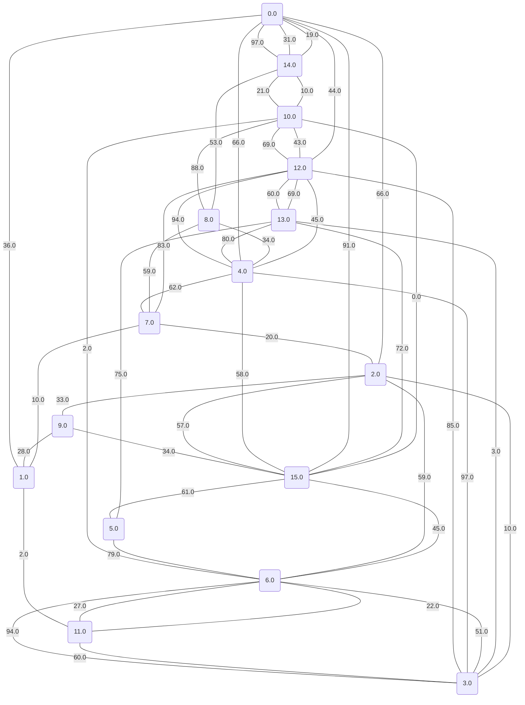

```mermaid
graph TD;
	0("0.0");
	1("1.0");
	2("2.0");
	3("3.0");
	4("4.0");
	5("5.0");
	6("6.0");
	7("7.0");
	8("8.0");
	9("9.0");
	10("10.0");
	11("11.0");
	12("12.0");
	13("13.0");
	14("14.0");
	15("15.0");
	4 -- "62.0" --- 7;
	14 -- "31.0" --- 0;
	15 -- "91.0" --- 0;
	10 -- "69.0" --- 12;
	14 -- "19.0" --- 0;
	15 -- "72.0" --- 13;
	6 -- "59.0" --- 2;
	15 -- "61.0" --- 5;
	10 -- "88.0" --- 8;
	0 -- "97.0" --- 14;
	1 -- "2.0" --- 11;
	8 -- "53.0" --- 14;
	7 -- "20.0" --- 2;
	0 -- "36.0" --- 1;
	15 -- "0.0" --- 10;
	3 -- "85.0" --- 12;
	8 -- "59.0" --- 7;
	12 -- "60.0" --- 13;
	6 -- "94.0" --- 3;
	9 -- "34.0" --- 15;
	10 -- "43.0" --- 12;
	3 -- "97.0" --- 4;
	2 -- "57.0" --- 15;
	11 -- "60.0" --- 3;
	10 -- "2.0" --- 6;
	5 -- "79.0" --- 6;
	3 -- "51.0" --- 6;
	4 -- "58.0" --- 15;
	3 -- "3.0" --- 13;
	2 -- "33.0" --- 9;
	9 -- "28.0" --- 1;
	14 -- "21.0" --- 10;
	4 -- "45.0" --- 12;
	12 -- "44.0" --- 0;
	7 -- "10.0" --- 1;
	12 -- "94.0" --- 4;
	13 -- "80.0" --- 4;
	0 -- "66.0" --- 4;
	6 -- "27.0" --- 11;
	14 -- "10.0" --- 10;
	3 -- "10.0" --- 2;
	0 -- "66.0" --- 2;
	6 -- "45.0" --- 15;
	13 -- "69.0" --- 12;
	6 -- "22.0" --- 11;
	8 -- "34.0" --- 4;
	7 -- "83.0" --- 12;
	5 -- "75.0" --- 13;
```

