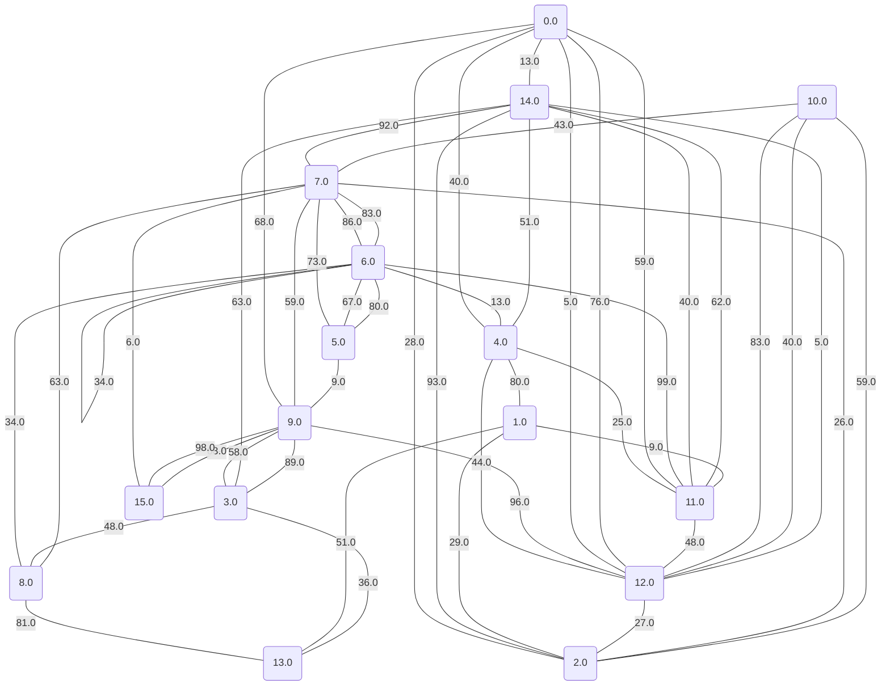

```mermaid
graph TD;
	0("0.0");
	1("1.0");
	2("2.0");
	3("3.0");
	4("4.0");
	5("5.0");
	6("6.0");
	7("7.0");
	8("8.0");
	9("9.0");
	10("10.0");
	11("11.0");
	12("12.0");
	13("13.0");
	14("14.0");
	15("15.0");
	10 -- "43.0" --- 7;
	3 -- "36.0" --- 13;
	14 -- "51.0" --- 4;
	1 -- "9.0" --- 11;
	14 -- "5.0" --- 12;
	2 -- "29.0" --- 1;
	10 -- "40.0" --- 12;
	2 -- "93.0" --- 14;
	10 -- "83.0" --- 12;
	6 -- "13.0" --- 4;
	14 -- "62.0" --- 11;
	11 -- "59.0" --- 0;
	12 -- "44.0" --- 4;
	5 -- "9.0" --- 9;
	3 -- "63.0" --- 14;
	8 -- "34.0" --- 6;
	14 -- "40.0" --- 11;
	6 -- "34.0" --- 6;
	6 -- "80.0" --- 5;
	9 -- "68.0" --- 15;
	1 -- "51.0" --- 13;
	11 -- "48.0" --- 12;
	0 -- "13.0" --- 14;
	10 -- "59.0" --- 2;
	6 -- "67.0" --- 5;
	15 -- "6.0" --- 7;
	0 -- "40.0" --- 4;
	7 -- "83.0" --- 6;
	14 -- "92.0" --- 7;
	6 -- "99.0" --- 11;
	8 -- "81.0" --- 13;
	11 -- "25.0" --- 4;
	9 -- "98.0" --- 15;
	9 -- "68.0" --- 0;
	7 -- "26.0" --- 2;
	7 -- "59.0" --- 9;
	0 -- "76.0" --- 12;
	0 -- "5.0" --- 12;
	2 -- "28.0" --- 0;
	9 -- "96.0" --- 12;
	7 -- "86.0" --- 6;
	3 -- "58.0" --- 9;
	7 -- "63.0" --- 8;
	9 -- "89.0" --- 3;
	5 -- "73.0" --- 7;
	3 -- "48.0" --- 8;
	12 -- "27.0" --- 2;
	4 -- "80.0" --- 1;
```

