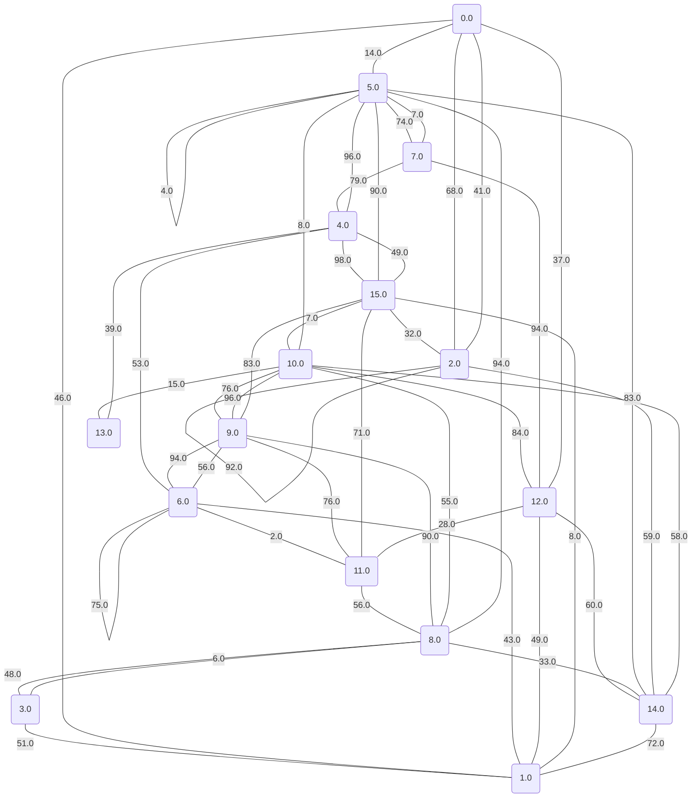

```mermaid
graph TD;
	0("0.0");
	1("1.0");
	2("2.0");
	3("3.0");
	4("4.0");
	5("5.0");
	6("6.0");
	7("7.0");
	8("8.0");
	9("9.0");
	10("10.0");
	11("11.0");
	12("12.0");
	13("13.0");
	14("14.0");
	15("15.0");
	10 -- "8.0" --- 5;
	10 -- "76.0" --- 9;
	7 -- "7.0" --- 5;
	11 -- "56.0" --- 8;
	6 -- "2.0" --- 11;
	10 -- "15.0" --- 13;
	12 -- "60.0" --- 14;
	9 -- "90.0" --- 8;
	2 -- "68.0" --- 0;
	5 -- "4.0" --- 5;
	3 -- "51.0" --- 1;
	0 -- "46.0" --- 1;
	12 -- "37.0" --- 0;
	4 -- "96.0" --- 5;
	15 -- "32.0" --- 2;
	9 -- "96.0" --- 10;
	2 -- "92.0" --- 2;
	4 -- "53.0" --- 6;
	8 -- "33.0" --- 14;
	6 -- "43.0" --- 1;
	2 -- "41.0" --- 0;
	12 -- "49.0" --- 1;
	10 -- "84.0" --- 12;
	15 -- "8.0" --- 1;
	8 -- "48.0" --- 3;
	6 -- "75.0" --- 6;
	8 -- "6.0" --- 3;
	5 -- "74.0" --- 7;
	9 -- "76.0" --- 11;
	14 -- "72.0" --- 1;
	15 -- "90.0" --- 5;
	9 -- "94.0" --- 6;
	9 -- "56.0" --- 6;
	7 -- "79.0" --- 4;
	10 -- "55.0" --- 8;
	5 -- "83.0" --- 14;
	0 -- "14.0" --- 5;
	2 -- "59.0" --- 14;
	4 -- "39.0" --- 13;
	9 -- "83.0" --- 15;
	7 -- "94.0" --- 12;
	15 -- "7.0" --- 10;
	4 -- "98.0" --- 15;
	15 -- "49.0" --- 4;
	10 -- "58.0" --- 14;
	5 -- "94.0" --- 8;
	15 -- "71.0" --- 11;
	12 -- "28.0" --- 11;
```

