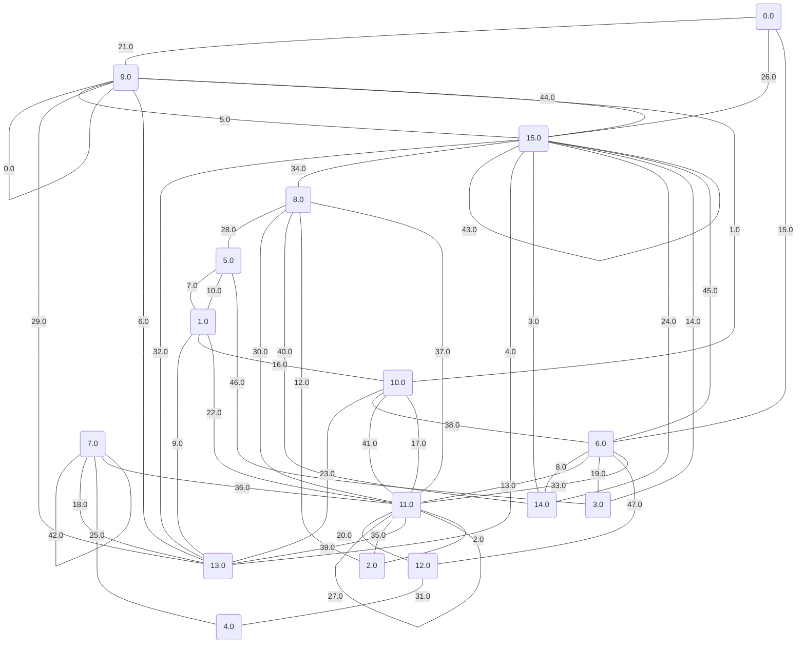

```mermaid
graph TD;
0("0.0");
1("1.0");
2("2.0");
3("3.0");
4("4.0");
5("5.0");
6("6.0");
7("7.0");
8("8.0");
9("9.0");
10("10.0");
11("11.0");
12("12.0");
13("13.0");
14("14.0");
15("15.0");
	9 -- "0.0" --- 9;
	10 -- "1.0" --- 9;
	2 -- "2.0" --- 11;
	14 -- "3.0" --- 15;
	13 -- "4.0" --- 15;
	9 -- "5.0" --- 15;
	13 -- "6.0" --- 9;
	5 -- "7.0" --- 1;
	6 -- "8.0" --- 14;
	1 -- "9.0" --- 13;
	1 -- "10.0" --- 5;
	7 -- "11.0" --- 7;
	2 -- "12.0" --- 8;
	6 -- "13.0" --- 11;
	3 -- "14.0" --- 15;
	6 -- "15.0" --- 0;
	1 -- "16.0" --- 10;
	11 -- "17.0" --- 10;
	7 -- "18.0" --- 13;
	6 -- "19.0" --- 3;
	11 -- "20.0" --- 12;
	0 -- "21.0" --- 9;
	11 -- "22.0" --- 1;
	10 -- "23.0" --- 13;
	14 -- "24.0" --- 15;
	7 -- "25.0" --- 4;
	15 -- "26.0" --- 0;
	11 -- "27.0" --- 11;
	8 -- "28.0" --- 5;
	9 -- "29.0" --- 13;
	8 -- "30.0" --- 11;
	12 -- "31.0" --- 4;
	15 -- "32.0" --- 13;
	11 -- "33.0" --- 6;
	15 -- "34.0" --- 8;
	11 -- "35.0" --- 2;
	7 -- "36.0" --- 11;
	11 -- "37.0" --- 8;
	10 -- "38.0" --- 6;
	11 -- "39.0" --- 13;
	14 -- "40.0" --- 8;
	10 -- "41.0" --- 11;
	7 -- "42.0" --- 7;
	15 -- "43.0" --- 15;
	15 -- "44.0" --- 9;
	6 -- "45.0" --- 15;
	3 -- "46.0" --- 5;
	6 -- "47.0" --- 12;
```
