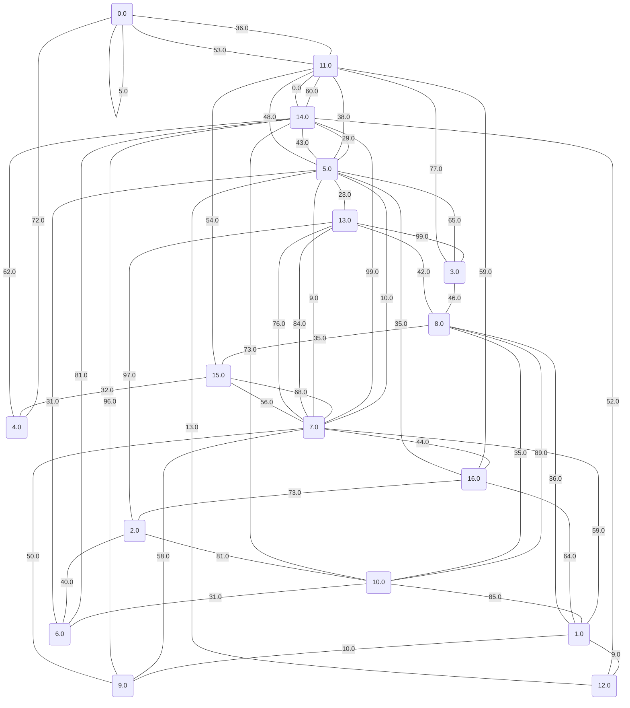

```mermaid
graph TD;
	0("0.0");
	1("1.0");
	2("2.0");
	3("3.0");
	4("4.0");
	5("5.0");
	6("6.0");
	7("7.0");
	8("8.0");
	9("9.0");
	10("10.0");
	11("11.0");
	12("12.0");
	13("13.0");
	14("14.0");
	15("15.0");
	16("16.0");
	8 -- "89.0" --- 10;
	11 -- "60.0" --- 14;
	5 -- "23.0" --- 13;
	14 -- "29.0" --- 5;
	12 -- "52.0" --- 14;
	8 -- "35.0" --- 10;
	13 -- "99.0" --- 3;
	0 -- "72.0" --- 4;
	11 -- "38.0" --- 5;
	0 -- "36.0" --- 11;
	1 -- "10.0" --- 9;
	1 -- "36.0" --- 8;
	15 -- "32.0" --- 4;
	14 -- "0.0" --- 11;
	2 -- "97.0" --- 13;
	5 -- "10.0" --- 7;
	10 -- "31.0" --- 6;
	7 -- "58.0" --- 9;
	14 -- "99.0" --- 7;
	7 -- "76.0" --- 13;
	15 -- "68.0" --- 7;
	3 -- "46.0" --- 8;
	7 -- "44.0" --- 16;
	3 -- "77.0" --- 11;
	14 -- "73.0" --- 10;
	5 -- "65.0" --- 3;
	7 -- "59.0" --- 1;
	10 -- "85.0" --- 1;
	1 -- "9.0" --- 12;
	14 -- "43.0" --- 5;
	16 -- "35.0" --- 5;
	11 -- "59.0" --- 16;
	14 -- "96.0" --- 9;
	5 -- "9.0" --- 7;
	8 -- "42.0" --- 13;
	16 -- "64.0" --- 1;
	11 -- "53.0" --- 0;
	15 -- "54.0" --- 11;
	6 -- "31.0" --- 5;
	7 -- "56.0" --- 15;
	14 -- "81.0" --- 6;
	16 -- "73.0" --- 2;
	7 -- "50.0" --- 9;
	12 -- "13.0" --- 5;
	2 -- "81.0" --- 10;
	2 -- "40.0" --- 6;
	14 -- "62.0" --- 4;
	0 -- "5.0" --- 0;
	13 -- "84.0" --- 7;
	11 -- "48.0" --- 5;
	8 -- "35.0" --- 15;
```

