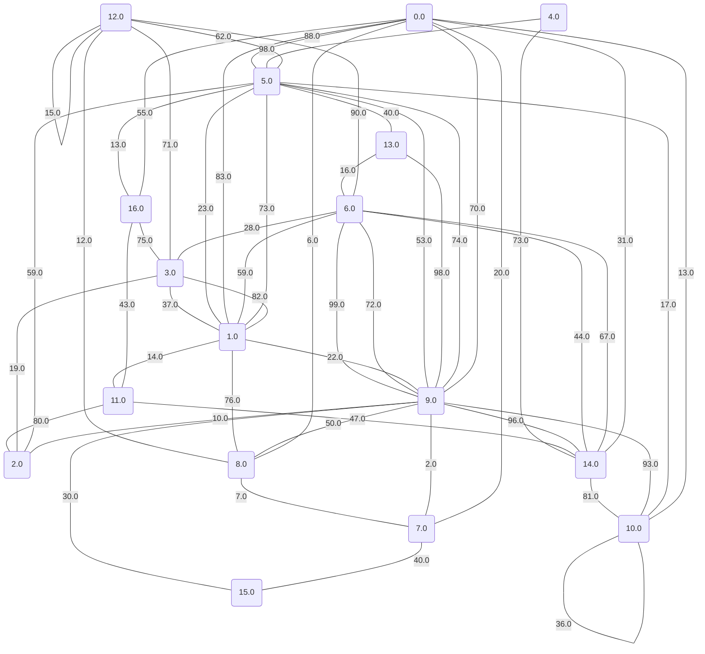

```mermaid
graph TD;
	0("0.0");
	1("1.0");
	2("2.0");
	3("3.0");
	4("4.0");
	5("5.0");
	6("6.0");
	7("7.0");
	8("8.0");
	9("9.0");
	10("10.0");
	11("11.0");
	12("12.0");
	13("13.0");
	14("14.0");
	15("15.0");
	16("16.0");
	1 -- "14.0" --- 11;
	13 -- "16.0" --- 6;
	10 -- "93.0" --- 9;
	10 -- "17.0" --- 5;
	10 -- "13.0" --- 0;
	12 -- "12.0" --- 8;
	1 -- "76.0" --- 8;
	14 -- "67.0" --- 6;
	11 -- "80.0" --- 2;
	1 -- "59.0" --- 6;
	7 -- "20.0" --- 0;
	14 -- "81.0" --- 10;
	9 -- "30.0" --- 15;
	12 -- "90.0" --- 6;
	3 -- "37.0" --- 1;
	5 -- "40.0" --- 13;
	0 -- "88.0" --- 5;
	5 -- "23.0" --- 1;
	6 -- "99.0" --- 9;
	8 -- "7.0" --- 7;
	16 -- "75.0" --- 3;
	7 -- "40.0" --- 15;
	1 -- "73.0" --- 5;
	10 -- "36.0" --- 10;
	12 -- "15.0" --- 12;
	12 -- "71.0" --- 3;
	16 -- "43.0" --- 11;
	6 -- "28.0" --- 3;
	1 -- "82.0" --- 3;
	14 -- "31.0" --- 0;
	6 -- "72.0" --- 9;
	4 -- "98.0" --- 5;
	4 -- "73.0" --- 14;
	1 -- "22.0" --- 9;
	3 -- "19.0" --- 2;
	9 -- "50.0" --- 8;
	11 -- "47.0" --- 14;
	5 -- "13.0" --- 16;
	5 -- "59.0" --- 2;
	0 -- "55.0" --- 16;
	5 -- "53.0" --- 9;
	9 -- "96.0" --- 14;
	9 -- "2.0" --- 7;
	9 -- "74.0" --- 5;
	8 -- "6.0" --- 0;
	0 -- "83.0" --- 1;
	13 -- "98.0" --- 9;
	9 -- "70.0" --- 0;
	9 -- "10.0" --- 2;
	12 -- "62.0" --- 5;
	6 -- "44.0" --- 14;
```

