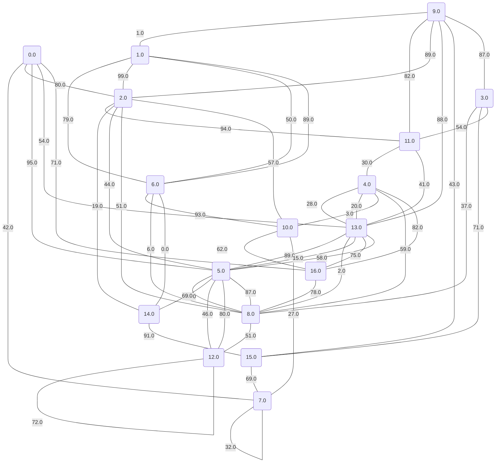

```mermaid
graph TD;
	0("0.0");
	1("1.0");
	2("2.0");
	3("3.0");
	4("4.0");
	5("5.0");
	6("6.0");
	7("7.0");
	8("8.0");
	9("9.0");
	10("10.0");
	11("11.0");
	12("12.0");
	13("13.0");
	14("14.0");
	15("15.0");
	16("16.0");
	12 -- "46.0" --- 5;
	9 -- "1.0" --- 1;
	3 -- "37.0" --- 8;
	8 -- "51.0" --- 12;
	13 -- "54.0" --- 0;
	13 -- "41.0" --- 11;
	1 -- "79.0" --- 6;
	6 -- "93.0" --- 10;
	8 -- "59.0" --- 4;
	13 -- "89.0" --- 5;
	4 -- "28.0" --- 13;
	3 -- "71.0" --- 15;
	1 -- "99.0" --- 2;
	2 -- "94.0" --- 11;
	10 -- "62.0" --- 16;
	12 -- "80.0" --- 5;
	5 -- "58.0" --- 13;
	4 -- "20.0" --- 13;
	9 -- "82.0" --- 11;
	5 -- "85.0" --- 8;
	13 -- "2.0" --- 8;
	2 -- "19.0" --- 14;
	13 -- "15.0" --- 5;
	13 -- "75.0" --- 16;
	6 -- "6.0" --- 8;
	0 -- "42.0" --- 7;
	3 -- "54.0" --- 11;
	0 -- "80.0" --- 2;
	5 -- "69.0" --- 14;
	6 -- "50.0" --- 1;
	16 -- "82.0" --- 4;
	4 -- "3.0" --- 10;
	6 -- "0.0" --- 14;
	2 -- "44.0" --- 5;
	9 -- "89.0" --- 2;
	0 -- "95.0" --- 5;
	10 -- "27.0" --- 7;
	7 -- "32.0" --- 7;
	10 -- "57.0" --- 2;
	9 -- "88.0" --- 13;
	15 -- "69.0" --- 7;
	6 -- "89.0" --- 1;
	12 -- "72.0" --- 12;
	9 -- "43.0" --- 15;
	16 -- "78.0" --- 8;
	11 -- "30.0" --- 4;
	14 -- "91.0" --- 15;
	2 -- "51.0" --- 8;
	16 -- "71.0" --- 0;
	9 -- "87.0" --- 3;
	8 -- "87.0" --- 5;
```

