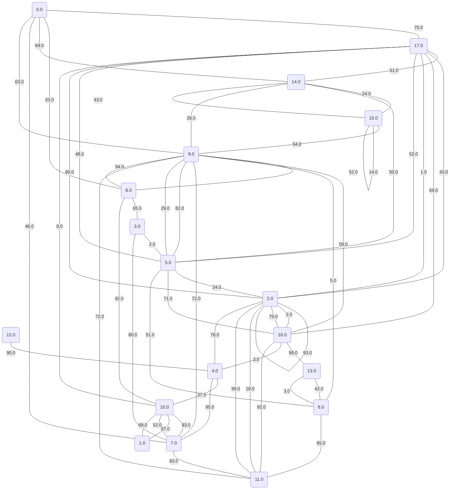

```mermaid
graph TD;
	0("0.0");
	1("1.0");
	2("2.0");
	3("3.0");
	4("4.0");
	5("5.0");
	6("6.0");
	7("7.0");
	8("8.0");
	9("9.0");
	10("10.0");
	11("11.0");
	12("12.0");
	13("13.0");
	14("14.0");
	15("15.0");
	16("16.0");
	17("17.0");
	7 -- "83.0" --- 11;
	12 -- "90.0" --- 4;
	4 -- "37.0" --- 10;
	8 -- "65.0" --- 3;
	2 -- "80.0" --- 17;
	17 -- "51.0" --- 14;
	0 -- "70.0" --- 17;
	9 -- "52.0" --- 8;
	10 -- "8.0" --- 17;
	5 -- "48.0" --- 17;
	0 -- "20.0" --- 8;
	10 -- "42.0" --- 8;
	3 -- "2.0" --- 5;
	2 -- "93.0" --- 2;
	9 -- "63.0" --- 0;
	2 -- "2.0" --- 16;
	11 -- "72.0" --- 9;
	9 -- "59.0" --- 16;
	9 -- "5.0" --- 6;
	16 -- "99.0" --- 13;
	11 -- "92.0" --- 16;
	7 -- "80.0" --- 3;
	8 -- "94.0" --- 9;
	0 -- "69.0" --- 14;
	10 -- "93.0" --- 7;
	17 -- "43.0" --- 2;
	13 -- "42.0" --- 6;
	11 -- "18.0" --- 2;
	16 -- "3.0" --- 4;
	13 -- "3.0" --- 6;
	5 -- "24.0" --- 2;
	9 -- "26.0" --- 14;
	15 -- "54.0" --- 9;
	15 -- "14.0" --- 15;
	9 -- "72.0" --- 7;
	14 -- "24.0" --- 15;
	9 -- "82.0" --- 5;
	11 -- "99.0" --- 2;
	2 -- "75.0" --- 16;
	9 -- "29.0" --- 5;
	7 -- "46.0" --- 0;
	4 -- "76.0" --- 2;
	10 -- "87.0" --- 1;
	5 -- "71.0" --- 16;
	17 -- "69.0" --- 16;
	6 -- "51.0" --- 5;
	5 -- "50.0" --- 14;
	7 -- "95.0" --- 4;
	17 -- "1.0" --- 2;
	17 -- "52.0" --- 5;
	6 -- "85.0" --- 11;
	1 -- "89.0" --- 10;
	15 -- "43.0" --- 14;
	10 -- "52.0" --- 7;
```

