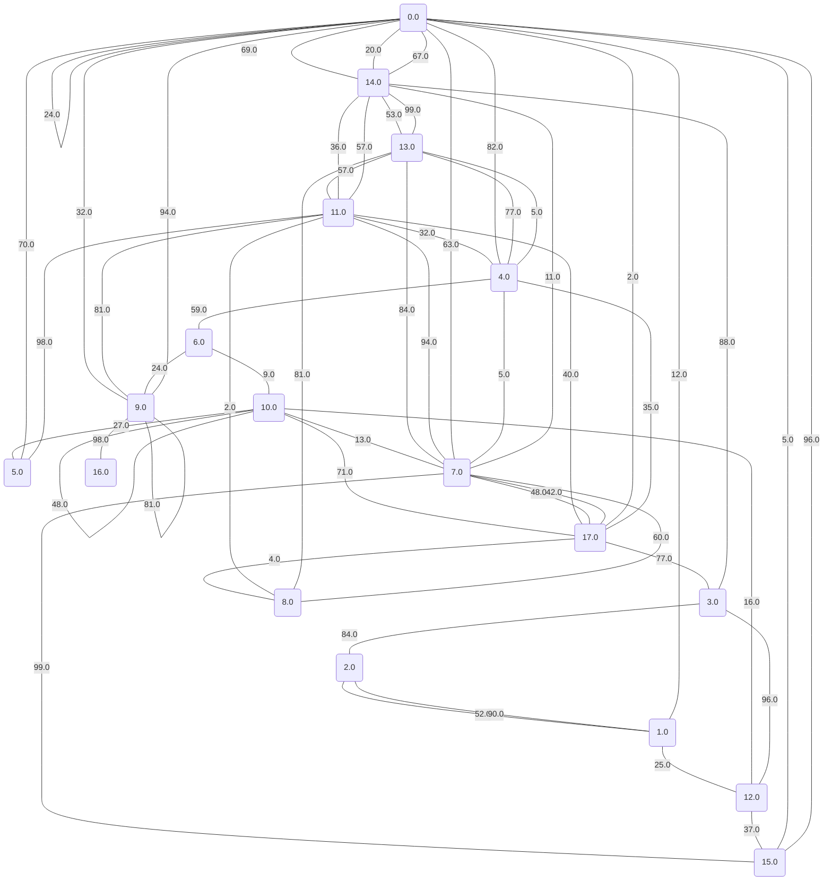

```mermaid
graph TD;
	0("0.0");
	1("1.0");
	2("2.0");
	3("3.0");
	4("4.0");
	5("5.0");
	6("6.0");
	7("7.0");
	8("8.0");
	9("9.0");
	10("10.0");
	11("11.0");
	12("12.0");
	13("13.0");
	14("14.0");
	15("15.0");
	16("16.0");
	17("17.0");
	17 -- "42.0" --- 7;
	4 -- "5.0" --- 13;
	9 -- "94.0" --- 0;
	13 -- "57.0" --- 11;
	10 -- "48.0" --- 10;
	1 -- "12.0" --- 0;
	10 -- "13.0" --- 7;
	11 -- "32.0" --- 4;
	6 -- "9.0" --- 10;
	17 -- "4.0" --- 8;
	14 -- "67.0" --- 0;
	0 -- "32.0" --- 9;
	15 -- "96.0" --- 0;
	4 -- "59.0" --- 6;
	10 -- "71.0" --- 17;
	7 -- "5.0" --- 4;
	11 -- "2.0" --- 8;
	11 -- "81.0" --- 9;
	7 -- "11.0" --- 14;
	0 -- "69.0" --- 14;
	13 -- "84.0" --- 7;
	1 -- "25.0" --- 12;
	0 -- "82.0" --- 4;
	17 -- "2.0" --- 0;
	2 -- "52.0" --- 1;
	7 -- "99.0" --- 15;
	11 -- "40.0" --- 17;
	12 -- "37.0" --- 15;
	14 -- "53.0" --- 13;
	3 -- "84.0" --- 2;
	12 -- "16.0" --- 10;
	13 -- "77.0" --- 4;
	14 -- "99.0" --- 13;
	11 -- "94.0" --- 7;
	6 -- "24.0" --- 9;
	0 -- "24.0" --- 0;
	11 -- "36.0" --- 14;
	0 -- "63.0" --- 7;
	10 -- "27.0" --- 5;
	0 -- "70.0" --- 5;
	9 -- "81.0" --- 9;
	0 -- "5.0" --- 15;
	13 -- "81.0" --- 8;
	17 -- "77.0" --- 3;
	9 -- "98.0" --- 16;
	7 -- "48.0" --- 17;
	12 -- "96.0" --- 3;
	0 -- "20.0" --- 14;
	11 -- "57.0" --- 14;
	8 -- "60.0" --- 7;
	2 -- "90.0" --- 1;
	3 -- "88.0" --- 14;
	17 -- "35.0" --- 4;
	5 -- "98.0" --- 11;
```

