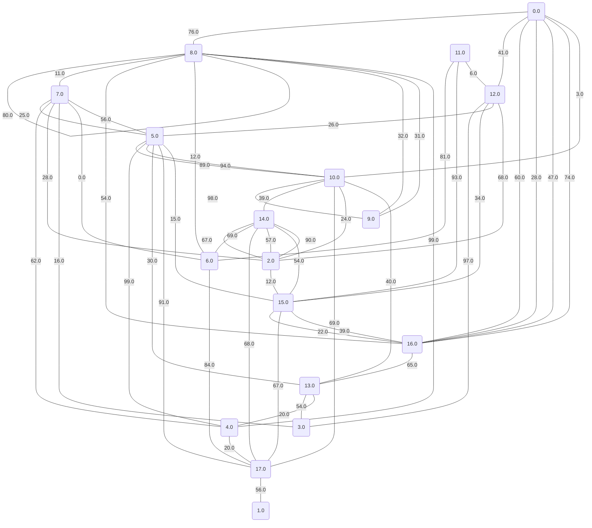

```mermaid
graph TD;
	0("0.0");
	1("1.0");
	2("2.0");
	3("3.0");
	4("4.0");
	5("5.0");
	6("6.0");
	7("7.0");
	8("8.0");
	9("9.0");
	10("10.0");
	11("11.0");
	12("12.0");
	13("13.0");
	14("14.0");
	15("15.0");
	16("16.0");
	17("17.0");
	15 -- "22.0" --- 16;
	5 -- "89.0" --- 10;
	13 -- "54.0" --- 3;
	5 -- "99.0" --- 4;
	11 -- "81.0" --- 6;
	9 -- "32.0" --- 8;
	15 -- "15.0" --- 5;
	3 -- "16.0" --- 7;
	5 -- "56.0" --- 7;
	0 -- "76.0" --- 8;
	10 -- "98.0" --- 9;
	10 -- "94.0" --- 5;
	7 -- "25.0" --- 5;
	13 -- "40.0" --- 10;
	10 -- "39.0" --- 14;
	8 -- "80.0" --- 8;
	4 -- "99.0" --- 8;
	7 -- "62.0" --- 4;
	16 -- "60.0" --- 0;
	2 -- "57.0" --- 14;
	12 -- "97.0" --- 3;
	16 -- "28.0" --- 0;
	4 -- "20.0" --- 17;
	2 -- "28.0" --- 7;
	13 -- "30.0" --- 5;
	14 -- "67.0" --- 2;
	15 -- "67.0" --- 17;
	13 -- "20.0" --- 4;
	10 -- "69.0" --- 17;
	17 -- "91.0" --- 5;
	17 -- "56.0" --- 1;
	12 -- "34.0" --- 15;
	15 -- "54.0" --- 14;
	8 -- "11.0" --- 7;
	10 -- "24.0" --- 2;
	10 -- "3.0" --- 0;
	16 -- "47.0" --- 0;
	9 -- "31.0" --- 8;
	6 -- "84.0" --- 17;
	8 -- "54.0" --- 16;
	11 -- "93.0" --- 15;
	2 -- "12.0" --- 15;
	11 -- "6.0" --- 12;
	14 -- "69.0" --- 6;
	16 -- "74.0" --- 0;
	15 -- "39.0" --- 16;
	2 -- "90.0" --- 14;
	14 -- "68.0" --- 17;
	6 -- "0.0" --- 7;
	12 -- "26.0" --- 5;
	8 -- "12.0" --- 6;
	12 -- "68.0" --- 2;
	16 -- "65.0" --- 13;
	0 -- "41.0" --- 12;
```

