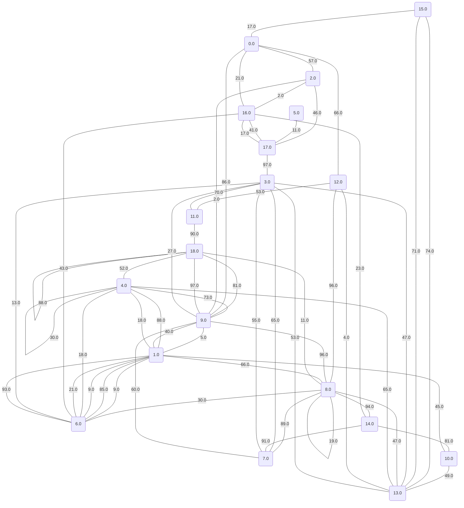

```mermaid
graph TD;
	0("0.0");
	1("1.0");
	2("2.0");
	3("3.0");
	4("4.0");
	5("5.0");
	6("6.0");
	7("7.0");
	8("8.0");
	9("9.0");
	10("10.0");
	11("11.0");
	12("12.0");
	13("13.0");
	14("14.0");
	15("15.0");
	16("16.0");
	17("17.0");
	18("18.0");
	2 -- "46.0" --- 17;
	9 -- "97.0" --- 18;
	12 -- "96.0" --- 8;
	2 -- "2.0" --- 16;
	5 -- "11.0" --- 17;
	16 -- "41.0" --- 17;
	8 -- "11.0" --- 18;
	10 -- "49.0" --- 13;
	16 -- "17.0" --- 17;
	15 -- "74.0" --- 13;
	4 -- "73.0" --- 9;
	1 -- "88.0" --- 4;
	9 -- "27.0" --- 3;
	8 -- "89.0" --- 7;
	18 -- "52.0" --- 4;
	11 -- "90.0" --- 18;
	8 -- "30.0" --- 6;
	1 -- "9.0" --- 6;
	9 -- "5.0" --- 1;
	0 -- "21.0" --- 16;
	8 -- "94.0" --- 14;
	3 -- "65.0" --- 7;
	18 -- "81.0" --- 9;
	1 -- "85.0" --- 6;
	4 -- "30.0" --- 4;
	15 -- "71.0" --- 13;
	0 -- "66.0" --- 12;
	9 -- "96.0" --- 8;
	8 -- "19.0" --- 8;
	14 -- "91.0" --- 7;
	0 -- "86.0" --- 9;
	1 -- "9.0" --- 6;
	17 -- "97.0" --- 3;
	6 -- "13.0" --- 3;
	3 -- "47.0" --- 13;
	12 -- "53.0" --- 11;
	8 -- "47.0" --- 13;
	10 -- "45.0" --- 1;
	1 -- "66.0" --- 8;
	0 -- "57.0" --- 2;
	15 -- "17.0" --- 0;
	14 -- "81.0" --- 10;
	4 -- "65.0" --- 13;
	2 -- "2.0" --- 9;
	3 -- "55.0" --- 7;
	3 -- "70.0" --- 11;
	4 -- "18.0" --- 6;
	9 -- "60.0" --- 7;
	1 -- "40.0" --- 9;
	12 -- "4.0" --- 13;
	1 -- "18.0" --- 4;
	13 -- "53.0" --- 3;
	1 -- "21.0" --- 6;
	16 -- "23.0" --- 14;
	6 -- "93.0" --- 1;
	16 -- "43.0" --- 6;
	18 -- "88.0" --- 18;
```

