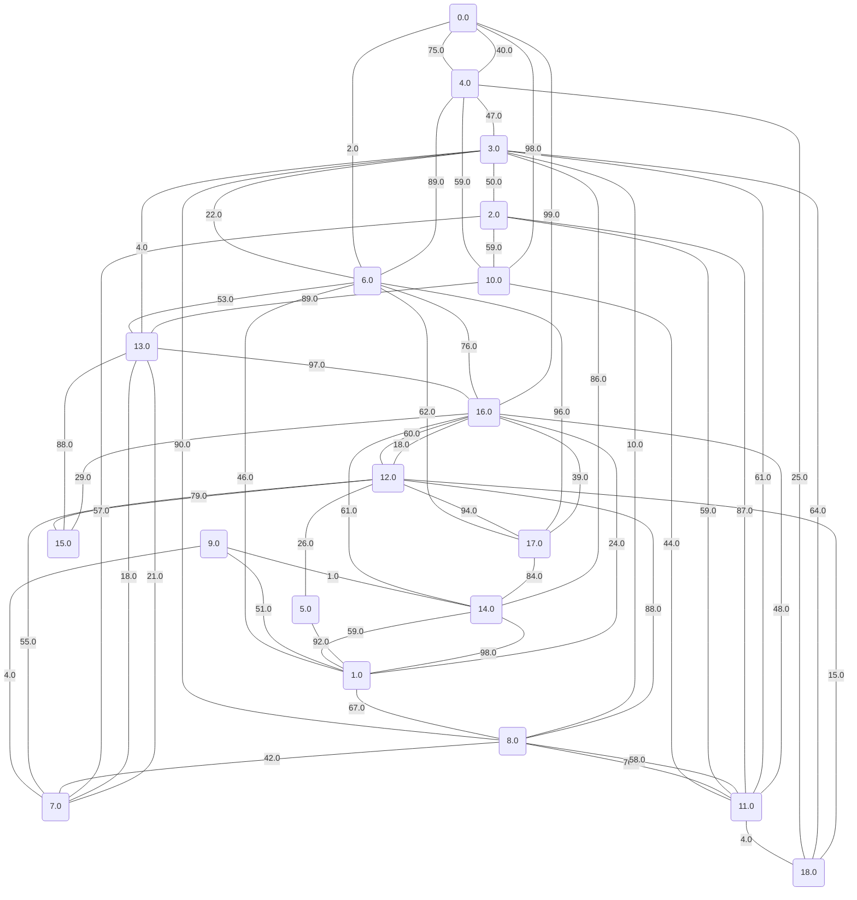

```mermaid
graph TD;
	0("0.0");
	1("1.0");
	2("2.0");
	3("3.0");
	4("4.0");
	5("5.0");
	6("6.0");
	7("7.0");
	8("8.0");
	9("9.0");
	10("10.0");
	11("11.0");
	12("12.0");
	13("13.0");
	14("14.0");
	15("15.0");
	16("16.0");
	17("17.0");
	18("18.0");
	12 -- "18.0" --- 16;
	4 -- "40.0" --- 0;
	6 -- "2.0" --- 0;
	10 -- "44.0" --- 11;
	8 -- "10.0" --- 3;
	3 -- "22.0" --- 6;
	9 -- "4.0" --- 7;
	18 -- "64.0" --- 3;
	7 -- "18.0" --- 13;
	6 -- "53.0" --- 13;
	15 -- "29.0" --- 16;
	6 -- "62.0" --- 17;
	12 -- "94.0" --- 17;
	16 -- "60.0" --- 12;
	12 -- "55.0" --- 7;
	8 -- "76.0" --- 11;
	9 -- "1.0" --- 14;
	8 -- "42.0" --- 7;
	0 -- "75.0" --- 4;
	11 -- "48.0" --- 16;
	3 -- "4.0" --- 13;
	6 -- "46.0" --- 1;
	9 -- "51.0" --- 1;
	17 -- "39.0" --- 16;
	14 -- "86.0" --- 3;
	4 -- "47.0" --- 3;
	2 -- "57.0" --- 7;
	8 -- "88.0" --- 12;
	2 -- "59.0" --- 11;
	11 -- "4.0" --- 18;
	16 -- "61.0" --- 14;
	3 -- "50.0" --- 2;
	10 -- "89.0" --- 13;
	14 -- "59.0" --- 1;
	8 -- "58.0" --- 11;
	4 -- "59.0" --- 10;
	2 -- "59.0" --- 10;
	6 -- "96.0" --- 17;
	18 -- "15.0" --- 12;
	0 -- "98.0" --- 10;
	12 -- "26.0" --- 5;
	3 -- "90.0" --- 8;
	2 -- "87.0" --- 11;
	16 -- "76.0" --- 6;
	6 -- "89.0" --- 4;
	13 -- "97.0" --- 16;
	12 -- "79.0" --- 15;
	17 -- "84.0" --- 14;
	5 -- "92.0" --- 1;
	1 -- "98.0" --- 14;
	16 -- "99.0" --- 0;
	7 -- "21.0" --- 13;
	4 -- "25.0" --- 18;
	13 -- "88.0" --- 15;
	1 -- "24.0" --- 16;
	3 -- "61.0" --- 11;
	1 -- "67.0" --- 8;
```

