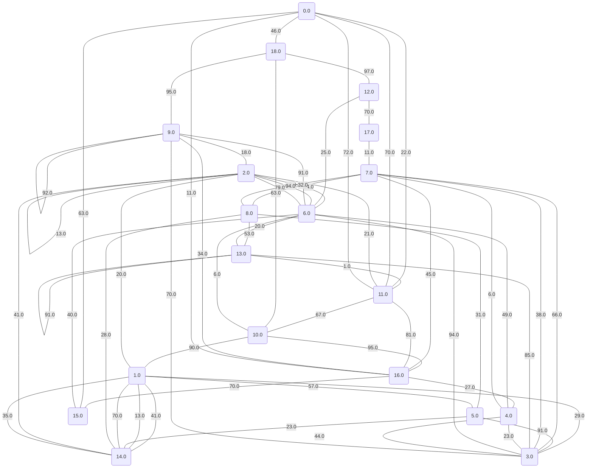

```mermaid
graph TD;
	0("0.0");
	1("1.0");
	2("2.0");
	3("3.0");
	4("4.0");
	5("5.0");
	6("6.0");
	7("7.0");
	8("8.0");
	9("9.0");
	10("10.0");
	11("11.0");
	12("12.0");
	13("13.0");
	14("14.0");
	15("15.0");
	16("16.0");
	17("17.0");
	18("18.0");
	12 -- "70.0" --- 17;
	13 -- "91.0" --- 13;
	11 -- "70.0" --- 0;
	8 -- "31.0" --- 5;
	16 -- "34.0" --- 9;
	0 -- "46.0" --- 18;
	15 -- "63.0" --- 0;
	1 -- "41.0" --- 14;
	8 -- "53.0" --- 13;
	3 -- "94.0" --- 6;
	1 -- "29.0" --- 3;
	1 -- "13.0" --- 14;
	11 -- "67.0" --- 10;
	5 -- "91.0" --- 3;
	10 -- "95.0" --- 16;
	10 -- "6.0" --- 6;
	1 -- "57.0" --- 5;
	7 -- "45.0" --- 16;
	9 -- "92.0" --- 9;
	2 -- "14.0" --- 6;
	8 -- "13.0" --- 7;
	5 -- "23.0" --- 14;
	11 -- "21.0" --- 2;
	10 -- "90.0" --- 1;
	9 -- "18.0" --- 2;
	11 -- "81.0" --- 16;
	2 -- "20.0" --- 1;
	15 -- "40.0" --- 6;
	7 -- "66.0" --- 3;
	12 -- "25.0" --- 6;
	7 -- "38.0" --- 3;
	2 -- "94.0" --- 6;
	1 -- "70.0" --- 14;
	2 -- "13.0" --- 2;
	16 -- "27.0" --- 4;
	3 -- "44.0" --- 4;
	13 -- "1.0" --- 11;
	13 -- "85.0" --- 3;
	4 -- "23.0" --- 3;
	3 -- "70.0" --- 9;
	6 -- "91.0" --- 9;
	18 -- "95.0" --- 9;
	16 -- "70.0" --- 15;
	16 -- "11.0" --- 0;
	14 -- "41.0" --- 2;
	6 -- "79.0" --- 2;
	6 -- "49.0" --- 4;
	7 -- "6.0" --- 4;
	11 -- "72.0" --- 0;
	0 -- "22.0" --- 11;
	8 -- "28.0" --- 14;
	7 -- "32.0" --- 8;
	18 -- "97.0" --- 12;
	18 -- "63.0" --- 10;
	14 -- "35.0" --- 1;
	17 -- "11.0" --- 7;
	6 -- "20.0" --- 13;
```

