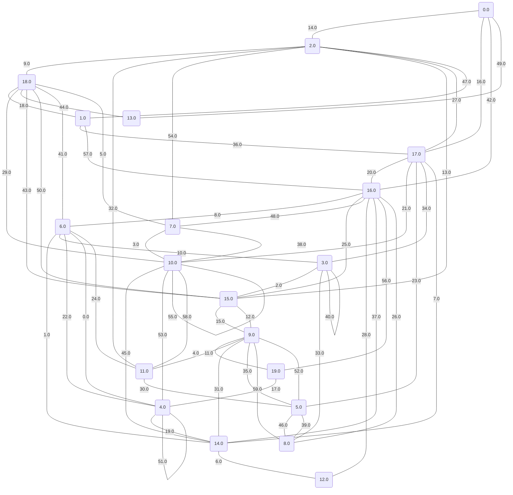

```mermaid
graph TD;
0("0.0");
1("1.0");
2("2.0");
3("3.0");
4("4.0");
5("5.0");
6("6.0");
7("7.0");
8("8.0");
9("9.0");
10("10.0");
11("11.0");
12("12.0");
13("13.0");
14("14.0");
15("15.0");
16("16.0");
17("17.0");
18("18.0");
19("19.0");
	4 -- "0.0" --- 6;
	6 -- "1.0" --- 14;
	3 -- "2.0" --- 15;
	7 -- "3.0" --- 10;
	9 -- "4.0" --- 19;
	7 -- "5.0" --- 18;
	14 -- "6.0" --- 12;
	14 -- "7.0" --- 17;
	16 -- "8.0" --- 6;
	2 -- "9.0" --- 18;
	6 -- "10.0" --- 3;
	9 -- "11.0" --- 11;
	9 -- "12.0" --- 15;
	15 -- "13.0" --- 2;
	0 -- "14.0" --- 2;
	15 -- "15.0" --- 9;
	0 -- "16.0" --- 17;
	19 -- "17.0" --- 4;
	18 -- "18.0" --- 1;
	4 -- "19.0" --- 14;
	17 -- "20.0" --- 16;
	17 -- "21.0" --- 10;
	6 -- "22.0" --- 4;
	17 -- "23.0" --- 5;
	11 -- "24.0" --- 6;
	16 -- "25.0" --- 15;
	8 -- "26.0" --- 16;
	17 -- "27.0" --- 2;
	12 -- "28.0" --- 16;
	18 -- "29.0" --- 10;
	11 -- "30.0" --- 5;
	9 -- "31.0" --- 14;
	2 -- "32.0" --- 11;
	3 -- "33.0" --- 8;
	17 -- "34.0" --- 3;
	9 -- "35.0" --- 5;
	1 -- "36.0" --- 17;
	14 -- "37.0" --- 16;
	10 -- "38.0" --- 7;
	8 -- "39.0" --- 5;
	3 -- "40.0" --- 3;
	6 -- "41.0" --- 18;
	0 -- "42.0" --- 16;
	15 -- "43.0" --- 18;
	18 -- "44.0" --- 13;
	10 -- "45.0" --- 14;
	5 -- "46.0" --- 8;
	1 -- "47.0" --- 2;
	16 -- "48.0" --- 7;
	13 -- "49.0" --- 0;
	15 -- "50.0" --- 18;
	4 -- "51.0" --- 4;
	5 -- "52.0" --- 9;
	10 -- "53.0" --- 4;
	2 -- "54.0" --- 7;
	10 -- "55.0" --- 10;
	19 -- "56.0" --- 16;
	1 -- "57.0" --- 16;
	10 -- "58.0" --- 11;
	9 -- "59.0" --- 8;
```
