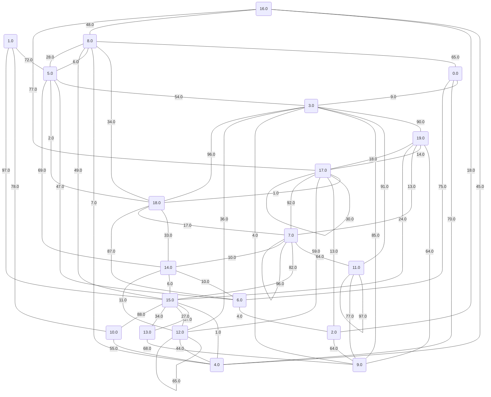

```mermaid
graph TD;
	0("0.0");
	1("1.0");
	2("2.0");
	3("3.0");
	4("4.0");
	5("5.0");
	6("6.0");
	7("7.0");
	8("8.0");
	9("9.0");
	10("10.0");
	11("11.0");
	12("12.0");
	13("13.0");
	14("14.0");
	15("15.0");
	16("16.0");
	17("17.0");
	18("18.0");
	19("19.0");
	1 -- "72.0" --- 5;
	15 -- "1.0" --- 4;
	15 -- "37.0" --- 13;
	7 -- "64.0" --- 11;
	15 -- "27.0" --- 12;
	5 -- "54.0" --- 3;
	2 -- "64.0" --- 9;
	12 -- "36.0" --- 3;
	17 -- "1.0" --- 18;
	15 -- "34.0" --- 13;
	8 -- "65.0" --- 0;
	7 -- "82.0" --- 15;
	17 -- "18.0" --- 19;
	16 -- "45.0" --- 4;
	12 -- "16.0" --- 12;
	1 -- "78.0" --- 10;
	1 -- "97.0" --- 15;
	8 -- "34.0" --- 18;
	0 -- "9.0" --- 3;
	11 -- "97.0" --- 11;
	7 -- "92.0" --- 17;
	16 -- "18.0" --- 2;
	13 -- "68.0" --- 9;
	15 -- "88.0" --- 10;
	8 -- "7.0" --- 4;
	3 -- "90.0" --- 19;
	18 -- "33.0" --- 14;
	10 -- "55.0" --- 4;
	6 -- "4.0" --- 2;
	12 -- "11.0" --- 14;
	0 -- "70.0" --- 4;
	19 -- "64.0" --- 9;
	3 -- "91.0" --- 11;
	7 -- "96.0" --- 7;
	14 -- "10.0" --- 6;
	18 -- "96.0" --- 3;
	2 -- "13.0" --- 17;
	8 -- "6.0" --- 5;
	17 -- "30.0" --- 17;
	7 -- "10.0" --- 14;
	5 -- "47.0" --- 6;
	11 -- "77.0" --- 9;
	19 -- "14.0" --- 17;
	16 -- "48.0" --- 8;
	8 -- "49.0" --- 15;
	18 -- "17.0" --- 7;
	16 -- "77.0" --- 17;
	5 -- "2.0" --- 18;
	12 -- "59.0" --- 17;
	12 -- "44.0" --- 4;
	14 -- "6.0" --- 15;
	3 -- "85.0" --- 9;
	15 -- "24.0" --- 19;
	6 -- "87.0" --- 18;
	0 -- "75.0" --- 6;
	12 -- "65.0" --- 12;
	5 -- "69.0" --- 14;
	8 -- "28.0" --- 5;
	19 -- "13.0" --- 7;
	9 -- "4.0" --- 3;
```

