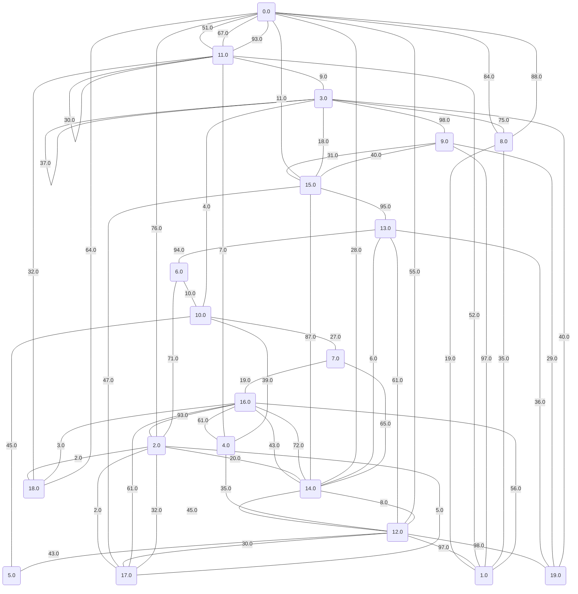

```mermaid
graph TD;
	0("0.0");
	1("1.0");
	2("2.0");
	3("3.0");
	4("4.0");
	5("5.0");
	6("6.0");
	7("7.0");
	8("8.0");
	9("9.0");
	10("10.0");
	11("11.0");
	12("12.0");
	13("13.0");
	14("14.0");
	15("15.0");
	16("16.0");
	17("17.0");
	18("18.0");
	19("19.0");
	13 -- "94.0" --- 6;
	10 -- "45.0" --- 5;
	3 -- "98.0" --- 9;
	19 -- "40.0" --- 3;
	14 -- "45.0" --- 12;
	7 -- "19.0" --- 16;
	10 -- "27.0" --- 7;
	16 -- "93.0" --- 2;
	10 -- "4.0" --- 3;
	0 -- "51.0" --- 11;
	12 -- "61.0" --- 13;
	11 -- "93.0" --- 0;
	15 -- "18.0" --- 3;
	8 -- "19.0" --- 1;
	12 -- "43.0" --- 5;
	4 -- "7.0" --- 11;
	12 -- "55.0" --- 0;
	17 -- "32.0" --- 2;
	14 -- "72.0" --- 16;
	14 -- "87.0" --- 15;
	11 -- "9.0" --- 3;
	12 -- "97.0" --- 1;
	14 -- "28.0" --- 0;
	15 -- "40.0" --- 9;
	2 -- "2.0" --- 17;
	0 -- "84.0" --- 8;
	11 -- "52.0" --- 1;
	3 -- "37.0" --- 3;
	17 -- "5.0" --- 2;
	12 -- "8.0" --- 14;
	8 -- "88.0" --- 0;
	14 -- "6.0" --- 13;
	9 -- "31.0" --- 15;
	2 -- "2.0" --- 18;
	15 -- "95.0" --- 13;
	1 -- "56.0" --- 16;
	2 -- "76.0" --- 0;
	3 -- "75.0" --- 8;
	6 -- "10.0" --- 10;
	12 -- "98.0" --- 19;
	16 -- "43.0" --- 14;
	18 -- "64.0" --- 0;
	14 -- "65.0" --- 7;
	2 -- "20.0" --- 14;
	15 -- "47.0" --- 17;
	13 -- "36.0" --- 19;
	4 -- "35.0" --- 12;
	9 -- "29.0" --- 19;
	0 -- "11.0" --- 15;
	12 -- "30.0" --- 17;
	11 -- "32.0" --- 18;
	16 -- "61.0" --- 17;
	9 -- "97.0" --- 1;
	4 -- "39.0" --- 10;
	0 -- "67.0" --- 11;
	16 -- "61.0" --- 4;
	2 -- "71.0" --- 6;
	8 -- "35.0" --- 1;
	16 -- "3.0" --- 18;
	11 -- "30.0" --- 11;
```

