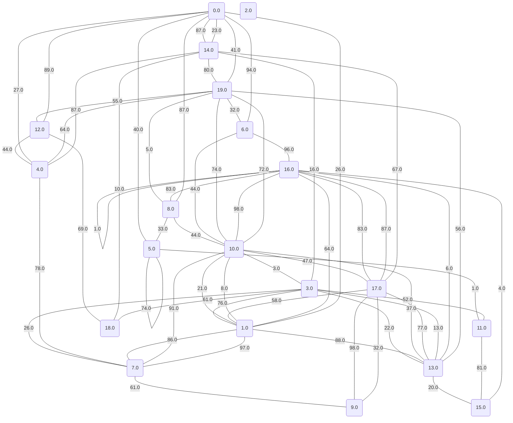

```mermaid
graph TD;
	0("0.0");
	1("1.0");
	2("2.0");
	3("3.0");
	4("4.0");
	5("5.0");
	6("6.0");
	7("7.0");
	8("8.0");
	9("9.0");
	10("10.0");
	11("11.0");
	12("12.0");
	13("13.0");
	14("14.0");
	15("15.0");
	16("16.0");
	17("17.0");
	18("18.0");
	19("19.0");
	10 -- "3.0" --- 3;
	7 -- "91.0" --- 10;
	14 -- "80.0" --- 19;
	19 -- "32.0" --- 6;
	0 -- "87.0" --- 14;
	0 -- "40.0" --- 5;
	17 -- "87.0" --- 16;
	6 -- "94.0" --- 0;
	6 -- "96.0" --- 16;
	8 -- "44.0" --- 10;
	7 -- "61.0" --- 9;
	4 -- "64.0" --- 19;
	13 -- "13.0" --- 3;
	3 -- "22.0" --- 13;
	17 -- "98.0" --- 9;
	10 -- "47.0" --- 17;
	13 -- "20.0" --- 15;
	7 -- "97.0" --- 1;
	8 -- "33.0" --- 5;
	16 -- "1.0" --- 16;
	5 -- "1.0" --- 11;
	11 -- "81.0" --- 15;
	12 -- "69.0" --- 18;
	19 -- "5.0" --- 8;
	3 -- "76.0" --- 1;
	10 -- "98.0" --- 16;
	1 -- "8.0" --- 10;
	16 -- "83.0" --- 8;
	19 -- "55.0" --- 12;
	0 -- "89.0" --- 12;
	8 -- "87.0" --- 0;
	10 -- "21.0" --- 1;
	13 -- "6.0" --- 16;
	17 -- "67.0" --- 14;
	0 -- "41.0" --- 19;
	0 -- "23.0" --- 14;
	15 -- "4.0" --- 16;
	10 -- "72.0" --- 19;
	3 -- "26.0" --- 7;
	1 -- "88.0" --- 13;
	13 -- "56.0" --- 19;
	1 -- "64.0" --- 16;
	17 -- "32.0" --- 9;
	14 -- "16.0" --- 3;
	12 -- "44.0" --- 4;
	4 -- "78.0" --- 7;
	16 -- "83.0" --- 17;
	6 -- "44.0" --- 10;
	10 -- "37.0" --- 13;
	1 -- "86.0" --- 7;
	14 -- "10.0" --- 18;
	5 -- "74.0" --- 5;
	3 -- "52.0" --- 11;
	1 -- "26.0" --- 0;
	17 -- "58.0" --- 1;
	4 -- "87.0" --- 14;
	17 -- "77.0" --- 13;
	3 -- "61.0" --- 18;
	19 -- "74.0" --- 10;
	0 -- "27.0" --- 4;
```

