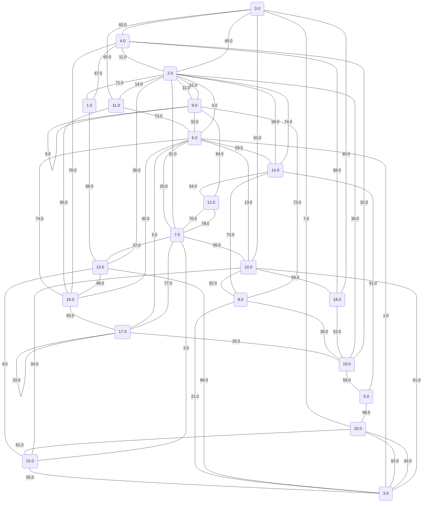

```mermaid
graph TD;
	0("0.0");
	1("1.0");
	2("2.0");
	3("3.0");
	4("4.0");
	5("5.0");
	6("6.0");
	7("7.0");
	8("8.0");
	9("9.0");
	10("10.0");
	11("11.0");
	12("12.0");
	13("13.0");
	14("14.0");
	15("15.0");
	16("16.0");
	17("17.0");
	18("18.0");
	19("19.0");
	20("20.0");
	6 -- "29.0" --- 14;
	10 -- "59.0" --- 18;
	10 -- "13.0" --- 6;
	11 -- "73.0" --- 6;
	9 -- "32.0" --- 6;
	0 -- "82.0" --- 4;
	17 -- "25.0" --- 19;
	9 -- "61.0" --- 2;
	18 -- "68.0" --- 4;
	0 -- "7.0" --- 20;
	19 -- "30.0" --- 2;
	15 -- "55.0" --- 3;
	8 -- "73.0" --- 14;
	14 -- "54.0" --- 12;
	19 -- "58.0" --- 5;
	14 -- "74.0" --- 2;
	8 -- "21.0" --- 3;
	8 -- "30.0" --- 19;
	2 -- "45.0" --- 0;
	7 -- "56.0" --- 10;
	2 -- "11.0" --- 9;
	6 -- "74.0" --- 16;
	18 -- "52.0" --- 19;
	1 -- "98.0" --- 13;
	16 -- "93.0" --- 17;
	12 -- "84.0" --- 9;
	13 -- "9.0" --- 15;
	2 -- "58.0" --- 14;
	6 -- "5.0" --- 17;
	10 -- "82.0" --- 8;
	6 -- "20.0" --- 7;
	19 -- "32.0" --- 4;
	4 -- "11.0" --- 2;
	11 -- "65.0" --- 16;
	9 -- "8.0" --- 9;
	4 -- "78.0" --- 16;
	10 -- "93.0" --- 0;
	13 -- "86.0" --- 3;
	1 -- "67.0" --- 4;
	13 -- "38.0" --- 2;
	2 -- "71.0" --- 1;
	16 -- "40.0" --- 6;
	0 -- "65.0" --- 11;
	15 -- "34.0" --- 10;
	15 -- "2.0" --- 7;
	3 -- "92.0" --- 20;
	5 -- "51.0" --- 14;
	8 -- "73.0" --- 9;
	20 -- "61.0" --- 15;
	2 -- "31.0" --- 7;
	12 -- "70.0" --- 7;
	6 -- "1.0" --- 3;
	18 -- "40.0" --- 0;
	2 -- "14.0" --- 11;
	7 -- "78.0" --- 12;
	5 -- "98.0" --- 20;
	17 -- "77.0" --- 7;
	7 -- "37.0" --- 13;
	13 -- "96.0" --- 16;
	3 -- "43.0" --- 20;
	2 -- "5.0" --- 6;
	3 -- "61.0" --- 10;
	17 -- "20.0" --- 17;
```

