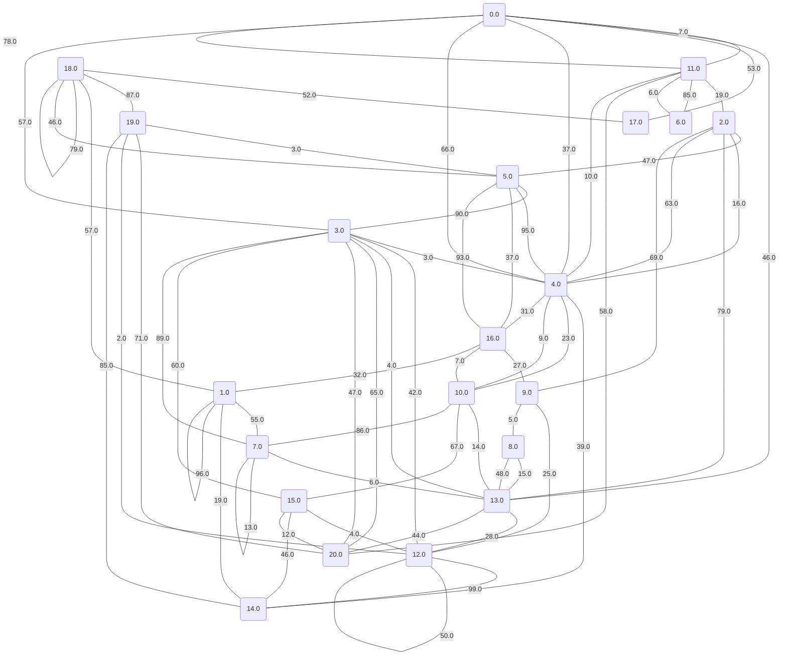

```mermaid
graph TD;
	0("0.0");
	1("1.0");
	2("2.0");
	3("3.0");
	4("4.0");
	5("5.0");
	6("6.0");
	7("7.0");
	8("8.0");
	9("9.0");
	10("10.0");
	11("11.0");
	12("12.0");
	13("13.0");
	14("14.0");
	15("15.0");
	16("16.0");
	17("17.0");
	18("18.0");
	19("19.0");
	20("20.0");
	19 -- "3.0" --- 5;
	2 -- "47.0" --- 5;
	20 -- "65.0" --- 3;
	13 -- "28.0" --- 12;
	7 -- "6.0" --- 13;
	3 -- "3.0" --- 4;
	1 -- "55.0" --- 7;
	13 -- "4.0" --- 3;
	18 -- "52.0" --- 17;
	10 -- "14.0" --- 13;
	9 -- "25.0" --- 12;
	11 -- "19.0" --- 2;
	11 -- "78.0" --- 0;
	0 -- "7.0" --- 11;
	2 -- "16.0" --- 4;
	18 -- "87.0" --- 19;
	9 -- "69.0" --- 2;
	18 -- "57.0" --- 1;
	4 -- "37.0" --- 0;
	12 -- "99.0" --- 14;
	11 -- "85.0" --- 6;
	16 -- "37.0" --- 5;
	10 -- "67.0" --- 15;
	15 -- "4.0" --- 12;
	4 -- "39.0" --- 14;
	4 -- "66.0" --- 0;
	20 -- "47.0" --- 3;
	4 -- "23.0" --- 10;
	7 -- "13.0" --- 7;
	13 -- "44.0" --- 20;
	15 -- "46.0" --- 14;
	19 -- "71.0" --- 20;
	9 -- "5.0" --- 8;
	15 -- "60.0" --- 3;
	16 -- "27.0" --- 9;
	4 -- "9.0" --- 10;
	16 -- "7.0" --- 10;
	11 -- "6.0" --- 6;
	4 -- "95.0" --- 5;
	3 -- "42.0" --- 12;
	2 -- "79.0" --- 13;
	5 -- "90.0" --- 3;
	16 -- "93.0" --- 5;
	0 -- "46.0" --- 13;
	1 -- "19.0" --- 14;
	15 -- "12.0" --- 20;
	18 -- "79.0" --- 18;
	4 -- "63.0" --- 2;
	7 -- "89.0" --- 3;
	19 -- "2.0" --- 12;
	10 -- "86.0" --- 7;
	19 -- "85.0" --- 14;
	12 -- "50.0" --- 12;
	8 -- "15.0" --- 13;
	20 -- "58.0" --- 11;
	8 -- "48.0" --- 13;
	4 -- "31.0" --- 16;
	18 -- "46.0" --- 5;
	1 -- "96.0" --- 1;
	16 -- "32.0" --- 1;
	0 -- "53.0" --- 17;
	4 -- "10.0" --- 11;
	3 -- "57.0" --- 0;
```

