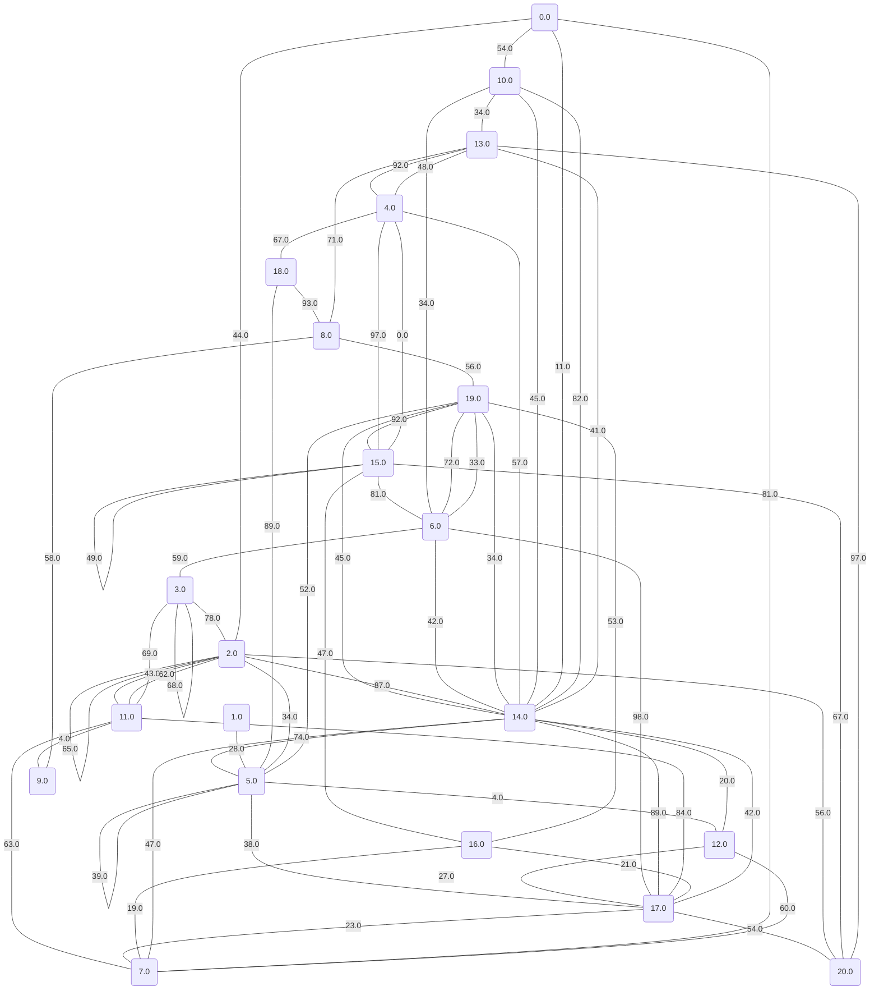

```mermaid
graph TD;
	0("0.0");
	1("1.0");
	2("2.0");
	3("3.0");
	4("4.0");
	5("5.0");
	6("6.0");
	7("7.0");
	8("8.0");
	9("9.0");
	10("10.0");
	11("11.0");
	12("12.0");
	13("13.0");
	14("14.0");
	15("15.0");
	16("16.0");
	17("17.0");
	18("18.0");
	19("19.0");
	20("20.0");
	4 -- "67.0" --- 18;
	19 -- "92.0" --- 15;
	5 -- "38.0" --- 17;
	5 -- "4.0" --- 12;
	16 -- "53.0" --- 19;
	14 -- "34.0" --- 19;
	3 -- "78.0" --- 2;
	6 -- "59.0" --- 3;
	11 -- "63.0" --- 7;
	12 -- "27.0" --- 17;
	6 -- "98.0" --- 17;
	10 -- "34.0" --- 13;
	14 -- "89.0" --- 17;
	15 -- "0.0" --- 4;
	15 -- "86.0" --- 15;
	8 -- "56.0" --- 19;
	14 -- "57.0" --- 4;
	19 -- "45.0" --- 14;
	17 -- "23.0" --- 7;
	2 -- "65.0" --- 2;
	18 -- "93.0" --- 8;
	16 -- "19.0" --- 7;
	14 -- "47.0" --- 7;
	20 -- "67.0" --- 15;
	2 -- "87.0" --- 14;
	15 -- "81.0" --- 6;
	14 -- "74.0" --- 5;
	13 -- "92.0" --- 4;
	3 -- "68.0" --- 3;
	14 -- "45.0" --- 10;
	17 -- "54.0" --- 20;
	9 -- "58.0" --- 8;
	6 -- "42.0" --- 14;
	11 -- "69.0" --- 3;
	0 -- "54.0" --- 10;
	4 -- "48.0" --- 13;
	11 -- "84.0" --- 17;
	16 -- "21.0" --- 17;
	0 -- "44.0" --- 2;
	5 -- "89.0" --- 18;
	8 -- "71.0" --- 13;
	2 -- "43.0" --- 11;
	11 -- "4.0" --- 9;
	5 -- "34.0" --- 2;
	14 -- "42.0" --- 17;
	20 -- "97.0" --- 13;
	6 -- "72.0" --- 19;
	5 -- "52.0" --- 19;
	14 -- "11.0" --- 0;
	14 -- "82.0" --- 10;
	14 -- "41.0" --- 13;
	1 -- "28.0" --- 5;
	2 -- "62.0" --- 11;
	10 -- "34.0" --- 6;
	0 -- "81.0" --- 7;
	12 -- "20.0" --- 14;
	4 -- "97.0" --- 15;
	5 -- "39.0" --- 5;
	12 -- "60.0" --- 7;
	2 -- "56.0" --- 20;
	15 -- "49.0" --- 15;
	15 -- "47.0" --- 16;
	6 -- "33.0" --- 19;
```

