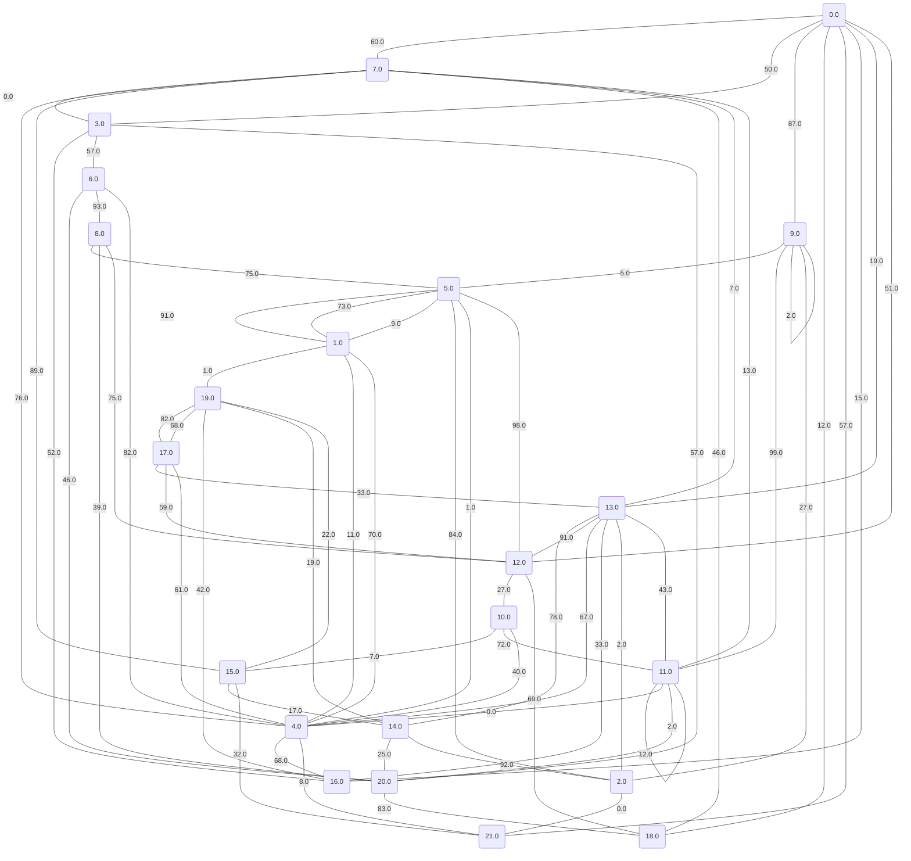

```mermaid
graph TD;
	0("0.0");
	1("1.0");
	2("2.0");
	3("3.0");
	4("4.0");
	5("5.0");
	6("6.0");
	7("7.0");
	8("8.0");
	9("9.0");
	10("10.0");
	11("11.0");
	12("12.0");
	13("13.0");
	14("14.0");
	15("15.0");
	16("16.0");
	17("17.0");
	18("18.0");
	19("19.0");
	20("20.0");
	21("21.0");
	10 -- "7.0" --- 15;
	14 -- "25.0" --- 20;
	18 -- "46.0" --- 7;
	20 -- "57.0" --- 3;
	7 -- "0.0" --- 3;
	7 -- "76.0" --- 4;
	14 -- "92.0" --- 2;
	4 -- "70.0" --- 1;
	2 -- "0.0" --- 21;
	12 -- "51.0" --- 0;
	4 -- "82.0" --- 6;
	5 -- "91.0" --- 1;
	12 -- "59.0" --- 17;
	13 -- "78.0" --- 14;
	11 -- "13.0" --- 7;
	19 -- "82.0" --- 17;
	3 -- "52.0" --- 16;
	0 -- "60.0" --- 7;
	19 -- "68.0" --- 17;
	1 -- "9.0" --- 5;
	11 -- "12.0" --- 11;
	17 -- "33.0" --- 13;
	4 -- "40.0" --- 10;
	15 -- "17.0" --- 14;
	11 -- "43.0" --- 13;
	8 -- "75.0" --- 5;
	2 -- "2.0" --- 13;
	20 -- "83.0" --- 18;
	13 -- "19.0" --- 0;
	2 -- "84.0" --- 5;
	8 -- "39.0" --- 20;
	11 -- "0.0" --- 4;
	12 -- "75.0" --- 8;
	1 -- "1.0" --- 19;
	13 -- "7.0" --- 7;
	3 -- "57.0" --- 6;
	4 -- "61.0" --- 17;
	9 -- "5.0" --- 5;
	19 -- "42.0" --- 16;
	11 -- "2.0" --- 20;
	5 -- "73.0" --- 1;
	15 -- "32.0" --- 21;
	13 -- "91.0" --- 12;
	12 -- "27.0" --- 10;
	0 -- "50.0" --- 3;
	12 -- "69.0" --- 18;
	15 -- "22.0" --- 19;
	9 -- "99.0" --- 11;
	0 -- "87.0" --- 9;
	0 -- "12.0" --- 18;
	9 -- "2.0" --- 9;
	0 -- "57.0" --- 21;
	9 -- "27.0" --- 2;
	7 -- "89.0" --- 15;
	10 -- "72.0" --- 11;
	13 -- "67.0" --- 4;
	6 -- "46.0" --- 20;
	4 -- "1.0" --- 5;
	16 -- "15.0" --- 0;
	12 -- "98.0" --- 5;
	13 -- "33.0" --- 16;
	1 -- "11.0" --- 4;
	6 -- "93.0" --- 8;
	4 -- "68.0" --- 16;
	4 -- "8.0" --- 21;
	14 -- "19.0" --- 19;
```

