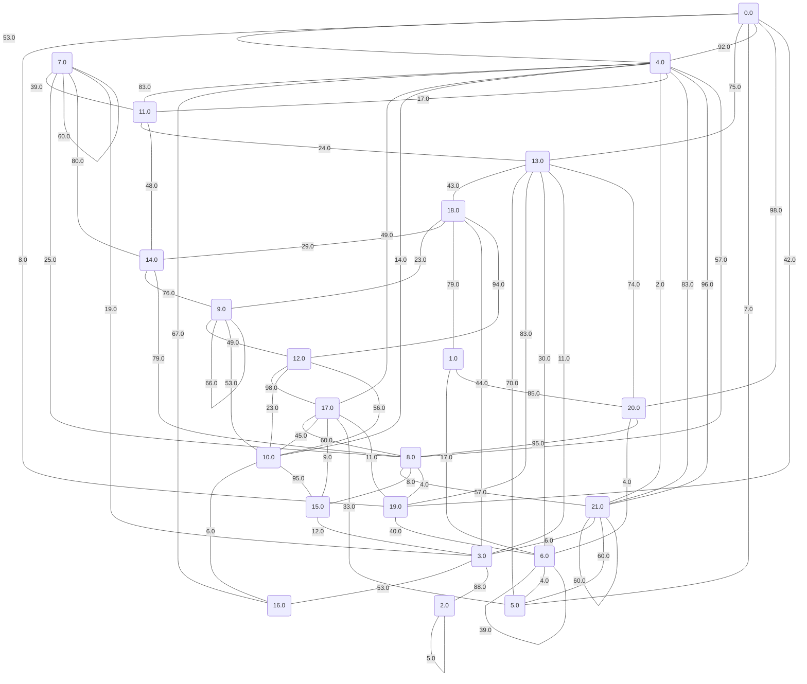

```mermaid
graph TD;
	0("0.0");
	1("1.0");
	2("2.0");
	3("3.0");
	4("4.0");
	5("5.0");
	6("6.0");
	7("7.0");
	8("8.0");
	9("9.0");
	10("10.0");
	11("11.0");
	12("12.0");
	13("13.0");
	14("14.0");
	15("15.0");
	16("16.0");
	17("17.0");
	18("18.0");
	19("19.0");
	20("20.0");
	21("21.0");
	13 -- "43.0" --- 18;
	5 -- "33.0" --- 17;
	7 -- "39.0" --- 11;
	0 -- "53.0" --- 4;
	10 -- "23.0" --- 12;
	14 -- "76.0" --- 9;
	17 -- "60.0" --- 8;
	4 -- "83.0" --- 11;
	2 -- "5.0" --- 2;
	9 -- "49.0" --- 12;
	0 -- "8.0" --- 19;
	10 -- "53.0" --- 9;
	7 -- "25.0" --- 8;
	8 -- "57.0" --- 21;
	9 -- "66.0" --- 9;
	12 -- "98.0" --- 17;
	21 -- "60.0" --- 21;
	3 -- "53.0" --- 16;
	19 -- "42.0" --- 0;
	3 -- "88.0" --- 2;
	13 -- "70.0" --- 5;
	0 -- "75.0" --- 13;
	21 -- "83.0" --- 4;
	7 -- "60.0" --- 7;
	13 -- "83.0" --- 19;
	14 -- "79.0" --- 8;
	4 -- "67.0" --- 16;
	0 -- "7.0" --- 5;
	10 -- "56.0" --- 12;
	20 -- "4.0" --- 6;
	21 -- "6.0" --- 3;
	8 -- "57.0" --- 4;
	18 -- "23.0" --- 9;
	6 -- "39.0" --- 6;
	15 -- "12.0" --- 3;
	0 -- "92.0" --- 4;
	4 -- "49.0" --- 17;
	12 -- "94.0" --- 18;
	13 -- "30.0" --- 6;
	18 -- "29.0" --- 14;
	14 -- "48.0" --- 11;
	1 -- "17.0" --- 6;
	10 -- "6.0" --- 16;
	21 -- "60.0" --- 5;
	10 -- "95.0" --- 15;
	20 -- "74.0" --- 13;
	21 -- "96.0" --- 4;
	4 -- "14.0" --- 10;
	19 -- "11.0" --- 17;
	6 -- "4.0" --- 5;
	11 -- "17.0" --- 4;
	11 -- "24.0" --- 13;
	17 -- "45.0" --- 10;
	20 -- "95.0" --- 8;
	19 -- "40.0" --- 6;
	0 -- "98.0" --- 20;
	3 -- "11.0" --- 13;
	18 -- "79.0" --- 1;
	7 -- "80.0" --- 14;
	4 -- "2.0" --- 21;
	1 -- "85.0" --- 20;
	7 -- "19.0" --- 3;
	3 -- "44.0" --- 18;
	8 -- "8.0" --- 15;
	8 -- "4.0" --- 19;
	17 -- "9.0" --- 15;
```

