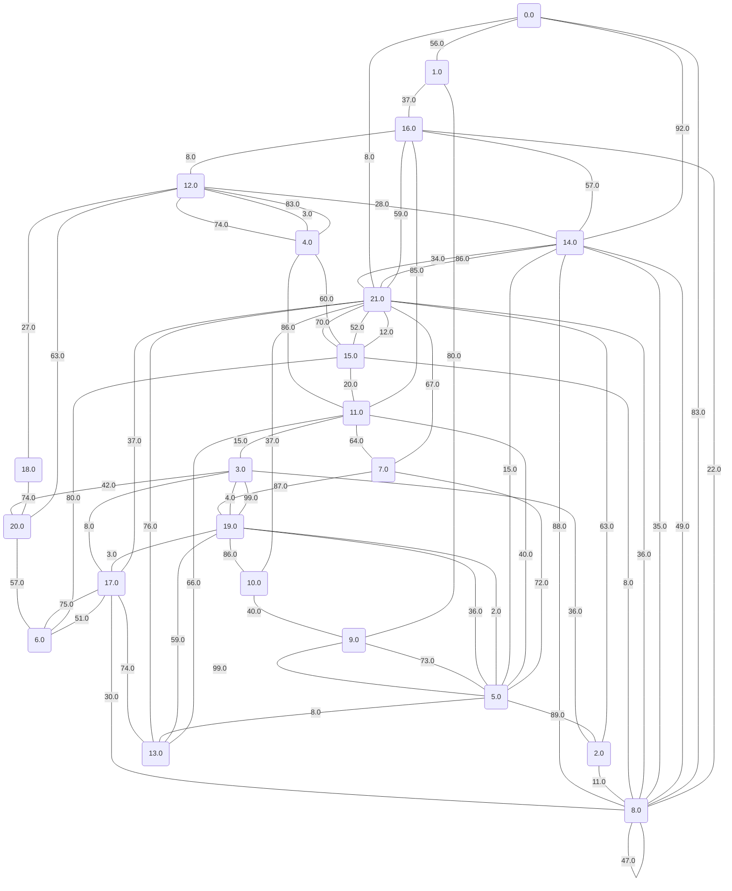

```mermaid
graph TD;
	0("0.0");
	1("1.0");
	2("2.0");
	3("3.0");
	4("4.0");
	5("5.0");
	6("6.0");
	7("7.0");
	8("8.0");
	9("9.0");
	10("10.0");
	11("11.0");
	12("12.0");
	13("13.0");
	14("14.0");
	15("15.0");
	16("16.0");
	17("17.0");
	18("18.0");
	19("19.0");
	20("20.0");
	21("21.0");
	0 -- "56.0" --- 1;
	8 -- "36.0" --- 21;
	20 -- "57.0" --- 6;
	12 -- "28.0" --- 14;
	4 -- "86.0" --- 11;
	10 -- "40.0" --- 9;
	12 -- "74.0" --- 4;
	21 -- "70.0" --- 15;
	17 -- "30.0" --- 8;
	1 -- "37.0" --- 16;
	3 -- "8.0" --- 17;
	10 -- "37.0" --- 21;
	12 -- "3.0" --- 4;
	4 -- "60.0" --- 15;
	19 -- "3.0" --- 17;
	13 -- "59.0" --- 19;
	15 -- "52.0" --- 21;
	7 -- "87.0" --- 19;
	3 -- "4.0" --- 19;
	16 -- "8.0" --- 12;
	21 -- "8.0" --- 0;
	14 -- "34.0" --- 21;
	17 -- "75.0" --- 6;
	8 -- "35.0" --- 14;
	9 -- "99.0" --- 5;
	3 -- "99.0" --- 19;
	3 -- "36.0" --- 2;
	17 -- "74.0" --- 13;
	5 -- "89.0" --- 2;
	14 -- "57.0" --- 16;
	21 -- "76.0" --- 13;
	15 -- "20.0" --- 11;
	21 -- "86.0" --- 14;
	9 -- "73.0" --- 5;
	5 -- "40.0" --- 11;
	19 -- "36.0" --- 5;
	12 -- "83.0" --- 4;
	5 -- "72.0" --- 7;
	19 -- "86.0" --- 10;
	3 -- "42.0" --- 20;
	9 -- "80.0" --- 1;
	8 -- "49.0" --- 14;
	2 -- "63.0" --- 21;
	14 -- "88.0" --- 8;
	11 -- "85.0" --- 16;
	2 -- "11.0" --- 8;
	13 -- "66.0" --- 11;
	19 -- "2.0" --- 5;
	15 -- "8.0" --- 8;
	21 -- "59.0" --- 16;
	20 -- "63.0" --- 12;
	5 -- "8.0" --- 13;
	8 -- "83.0" --- 0;
	14 -- "92.0" --- 0;
	15 -- "80.0" --- 6;
	17 -- "51.0" --- 6;
	14 -- "15.0" --- 5;
	11 -- "64.0" --- 7;
	8 -- "22.0" --- 16;
	8 -- "47.0" --- 8;
	17 -- "37.0" --- 21;
	11 -- "15.0" --- 3;
	12 -- "27.0" --- 18;
	15 -- "12.0" --- 21;
	18 -- "74.0" --- 20;
	7 -- "67.0" --- 21;
```

