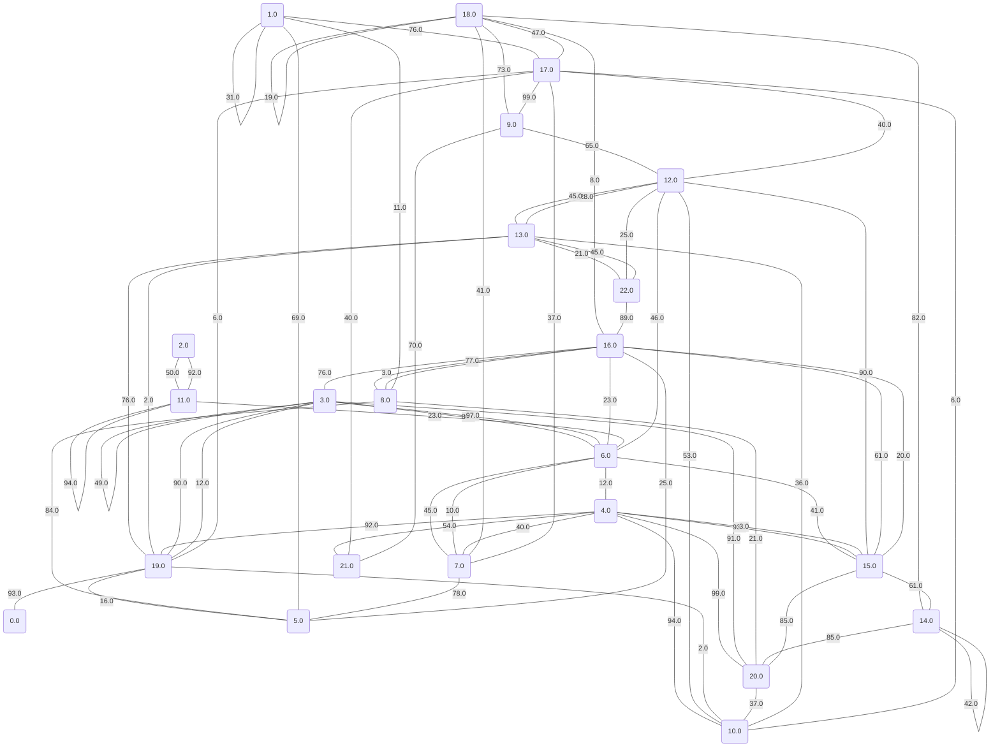

```mermaid
graph TD;
	0("0.0");
	1("1.0");
	2("2.0");
	3("3.0");
	4("4.0");
	5("5.0");
	6("6.0");
	7("7.0");
	8("8.0");
	9("9.0");
	10("10.0");
	11("11.0");
	12("12.0");
	13("13.0");
	14("14.0");
	15("15.0");
	16("16.0");
	17("17.0");
	18("18.0");
	19("19.0");
	20("20.0");
	21("21.0");
	22("22.0");
	2 -- "50.0" --- 11;
	4 -- "54.0" --- 21;
	19 -- "16.0" --- 5;
	3 -- "80.0" --- 6;
	8 -- "11.0" --- 1;
	13 -- "76.0" --- 19;
	4 -- "99.0" --- 20;
	19 -- "93.0" --- 0;
	11 -- "94.0" --- 11;
	17 -- "40.0" --- 21;
	16 -- "77.0" --- 8;
	1 -- "76.0" --- 17;
	6 -- "41.0" --- 15;
	13 -- "21.0" --- 22;
	16 -- "76.0" --- 3;
	4 -- "94.0" --- 10;
	3 -- "97.0" --- 6;
	6 -- "45.0" --- 7;
	6 -- "10.0" --- 7;
	18 -- "73.0" --- 9;
	1 -- "31.0" --- 1;
	18 -- "47.0" --- 17;
	15 -- "90.0" --- 12;
	8 -- "84.0" --- 5;
	16 -- "23.0" --- 6;
	9 -- "65.0" --- 12;
	19 -- "90.0" --- 3;
	6 -- "12.0" --- 4;
	12 -- "25.0" --- 22;
	12 -- "53.0" --- 10;
	19 -- "2.0" --- 10;
	19 -- "12.0" --- 3;
	18 -- "8.0" --- 16;
	18 -- "82.0" --- 14;
	10 -- "6.0" --- 17;
	13 -- "28.0" --- 12;
	20 -- "37.0" --- 10;
	22 -- "89.0" --- 16;
	7 -- "37.0" --- 17;
	13 -- "2.0" --- 19;
	3 -- "91.0" --- 20;
	15 -- "61.0" --- 16;
	4 -- "93.0" --- 15;
	8 -- "21.0" --- 20;
	13 -- "45.0" --- 22;
	1 -- "69.0" --- 5;
	4 -- "92.0" --- 19;
	4 -- "40.0" --- 7;
	13 -- "36.0" --- 10;
	14 -- "85.0" --- 20;
	14 -- "42.0" --- 14;
	17 -- "99.0" --- 9;
	2 -- "92.0" --- 11;
	15 -- "85.0" --- 20;
	5 -- "25.0" --- 16;
	15 -- "61.0" --- 14;
	17 -- "40.0" --- 12;
	7 -- "78.0" --- 5;
	9 -- "70.0" --- 21;
	4 -- "3.0" --- 15;
	3 -- "49.0" --- 3;
	6 -- "46.0" --- 12;
	12 -- "45.0" --- 13;
	18 -- "41.0" --- 7;
	15 -- "20.0" --- 16;
	19 -- "6.0" --- 17;
	18 -- "19.0" --- 18;
	11 -- "23.0" --- 6;
	16 -- "3.0" --- 8;
```

