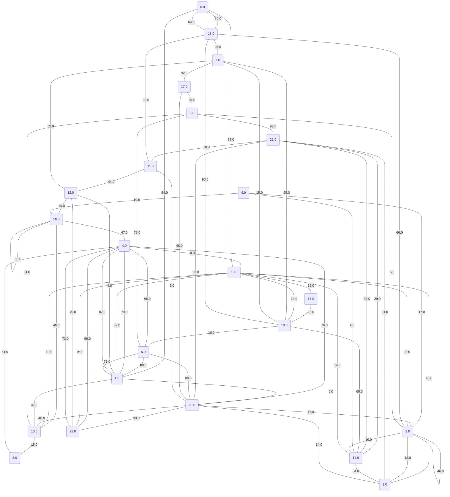

```mermaid
graph TD;
	0("0.0");
	1("1.0");
	2("2.0");
	3("3.0");
	4("4.0");
	5("5.0");
	6("6.0");
	7("7.0");
	8("8.0");
	9("9.0");
	10("10.0");
	11("11.0");
	12("12.0");
	13("13.0");
	14("14.0");
	15("15.0");
	16("16.0");
	17("17.0");
	18("18.0");
	19("19.0");
	20("20.0");
	21("21.0");
	22("22.0");
	11 -- "44.0" --- 12;
	4 -- "8.0" --- 18;
	20 -- "46.0" --- 17;
	19 -- "16.0" --- 6;
	4 -- "98.0" --- 6;
	16 -- "73.0" --- 16;
	2 -- "7.0" --- 2;
	14 -- "16.0" --- 18;
	5 -- "93.0" --- 22;
	2 -- "28.0" --- 18;
	2 -- "66.0" --- 13;
	2 -- "46.0" --- 2;
	18 -- "37.0" --- 0;
	13 -- "53.0" --- 0;
	1 -- "82.0" --- 18;
	21 -- "99.0" --- 4;
	0 -- "76.0" --- 13;
	0 -- "64.0" --- 1;
	1 -- "6.0" --- 20;
	20 -- "6.0" --- 11;
	19 -- "15.0" --- 7;
	12 -- "52.0" --- 7;
	1 -- "4.0" --- 12;
	22 -- "18.0" --- 11;
	16 -- "47.0" --- 4;
	16 -- "46.0" --- 10;
	18 -- "19.0" --- 10;
	6 -- "78.0" --- 5;
	11 -- "39.0" --- 13;
	18 -- "19.0" --- 15;
	3 -- "14.0" --- 20;
	6 -- "88.0" --- 1;
	8 -- "51.0" --- 4;
	1 -- "82.0" --- 4;
	22 -- "29.0" --- 14;
	22 -- "39.0" --- 14;
	20 -- "99.0" --- 21;
	12 -- "49.0" --- 16;
	19 -- "66.0" --- 14;
	9 -- "4.0" --- 14;
	21 -- "95.0" --- 18;
	4 -- "76.0" --- 20;
	18 -- "40.0" --- 3;
	20 -- "40.0" --- 10;
	21 -- "79.0" --- 12;
	10 -- "18.0" --- 8;
	2 -- "12.0" --- 3;
	9 -- "17.0" --- 2;
	7 -- "32.0" --- 17;
	1 -- "71.0" --- 6;
	21 -- "73.0" --- 4;
	4 -- "79.0" --- 1;
	16 -- "33.0" --- 16;
	15 -- "26.0" --- 19;
	10 -- "51.0" --- 5;
	18 -- "74.0" --- 19;
	1 -- "47.0" --- 10;
	22 -- "23.0" --- 20;
	13 -- "95.0" --- 7;
	19 -- "90.0" --- 13;
	22 -- "91.0" --- 3;
	17 -- "84.0" --- 5;
	20 -- "17.0" --- 2;
	2 -- "10.0" --- 14;
	9 -- "19.0" --- 16;
	14 -- "54.0" --- 3;
	7 -- "95.0" --- 19;
	6 -- "86.0" --- 20;
	2 -- "5.0" --- 5;
```

