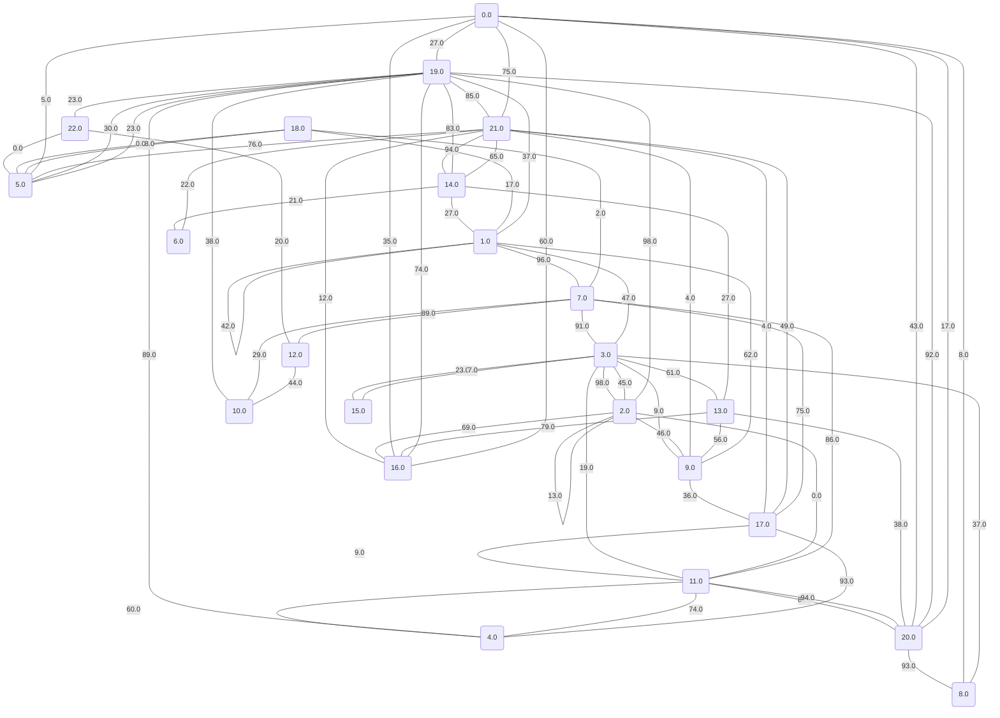

```mermaid
graph TD;
	0("0.0");
	1("1.0");
	2("2.0");
	3("3.0");
	4("4.0");
	5("5.0");
	6("6.0");
	7("7.0");
	8("8.0");
	9("9.0");
	10("10.0");
	11("11.0");
	12("12.0");
	13("13.0");
	14("14.0");
	15("15.0");
	16("16.0");
	17("17.0");
	18("18.0");
	19("19.0");
	20("20.0");
	21("21.0");
	22("22.0");
	1 -- "96.0" --- 7;
	3 -- "23.0" --- 15;
	2 -- "45.0" --- 3;
	21 -- "94.0" --- 14;
	19 -- "85.0" --- 21;
	20 -- "43.0" --- 0;
	11 -- "60.0" --- 4;
	21 -- "12.0" --- 16;
	22 -- "0.0" --- 5;
	4 -- "74.0" --- 11;
	3 -- "61.0" --- 13;
	20 -- "93.0" --- 8;
	2 -- "98.0" --- 19;
	21 -- "75.0" --- 0;
	11 -- "89.0" --- 20;
	2 -- "69.0" --- 16;
	9 -- "36.0" --- 17;
	17 -- "9.0" --- 11;
	0 -- "27.0" --- 19;
	1 -- "37.0" --- 19;
	5 -- "30.0" --- 19;
	3 -- "19.0" --- 11;
	18 -- "2.0" --- 7;
	6 -- "22.0" --- 21;
	18 -- "0.0" --- 5;
	0 -- "35.0" --- 16;
	16 -- "60.0" --- 0;
	22 -- "20.0" --- 12;
	2 -- "0.0" --- 11;
	13 -- "27.0" --- 14;
	8 -- "8.0" --- 0;
	21 -- "4.0" --- 17;
	7 -- "91.0" --- 3;
	18 -- "8.0" --- 5;
	20 -- "92.0" --- 19;
	1 -- "47.0" --- 3;
	1 -- "42.0" --- 1;
	3 -- "98.0" --- 2;
	13 -- "79.0" --- 16;
	0 -- "5.0" --- 5;
	3 -- "9.0" --- 9;
	21 -- "76.0" --- 5;
	4 -- "93.0" --- 17;
	14 -- "27.0" --- 1;
	21 -- "49.0" --- 17;
	8 -- "37.0" --- 3;
	18 -- "17.0" --- 1;
	7 -- "86.0" --- 11;
	19 -- "83.0" --- 14;
	19 -- "89.0" --- 4;
	21 -- "65.0" --- 14;
	11 -- "94.0" --- 20;
	20 -- "17.0" --- 0;
	19 -- "23.0" --- 22;
	7 -- "89.0" --- 12;
	19 -- "38.0" --- 10;
	2 -- "46.0" --- 9;
	21 -- "4.0" --- 9;
	14 -- "21.0" --- 6;
	19 -- "74.0" --- 16;
	5 -- "23.0" --- 19;
	7 -- "29.0" --- 10;
	13 -- "56.0" --- 9;
	15 -- "7.0" --- 3;
	12 -- "44.0" --- 10;
	2 -- "13.0" --- 2;
	17 -- "75.0" --- 7;
	13 -- "38.0" --- 20;
	1 -- "62.0" --- 9;
```

