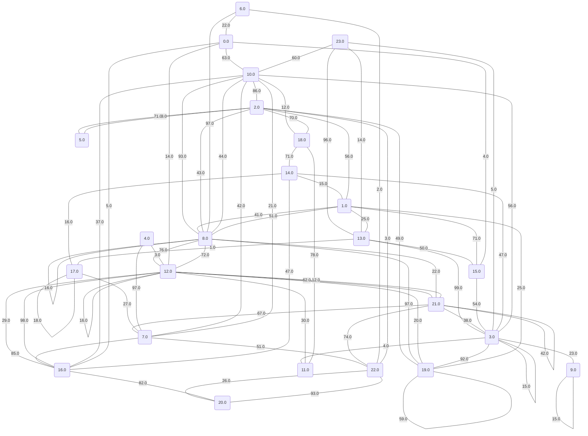

```mermaid
graph TD;
	0("0.0");
	1("1.0");
	2("2.0");
	3("3.0");
	4("4.0");
	5("5.0");
	6("6.0");
	7("7.0");
	8("8.0");
	9("9.0");
	10("10.0");
	11("11.0");
	12("12.0");
	13("13.0");
	14("14.0");
	15("15.0");
	16("16.0");
	17("17.0");
	18("18.0");
	19("19.0");
	20("20.0");
	21("21.0");
	22("22.0");
	23("23.0");
	3 -- "4.0" --- 11;
	10 -- "86.0" --- 2;
	2 -- "49.0" --- 19;
	12 -- "62.0" --- 21;
	22 -- "26.0" --- 20;
	13 -- "50.0" --- 15;
	7 -- "51.0" --- 22;
	0 -- "63.0" --- 10;
	13 -- "99.0" --- 3;
	10 -- "93.0" --- 8;
	8 -- "76.0" --- 12;
	10 -- "12.0" --- 18;
	12 -- "72.0" --- 8;
	21 -- "74.0" --- 22;
	23 -- "96.0" --- 13;
	12 -- "29.0" --- 16;
	21 -- "38.0" --- 3;
	16 -- "82.0" --- 20;
	21 -- "12.0" --- 12;
	9 -- "15.0" --- 9;
	19 -- "59.0" --- 19;
	2 -- "70.0" --- 18;
	15 -- "54.0" --- 3;
	1 -- "41.0" --- 8;
	23 -- "14.0" --- 13;
	2 -- "71.0" --- 5;
	21 -- "67.0" --- 7;
	12 -- "30.0" --- 11;
	15 -- "4.0" --- 0;
	17 -- "27.0" --- 7;
	14 -- "15.0" --- 1;
	8 -- "97.0" --- 19;
	7 -- "42.0" --- 10;
	18 -- "78.0" --- 11;
	8 -- "22.0" --- 21;
	16 -- "37.0" --- 10;
	23 -- "5.0" --- 3;
	7 -- "85.0" --- 16;
	12 -- "20.0" --- 19;
	1 -- "25.0" --- 13;
	3 -- "92.0" --- 19;
	1 -- "71.0" --- 15;
	6 -- "22.0" --- 0;
	3 -- "23.0" --- 9;
	17 -- "18.0" --- 17;
	4 -- "97.0" --- 7;
	2 -- "43.0" --- 8;
	1 -- "25.0" --- 19;
	5 -- "8.0" --- 2;
	4 -- "3.0" --- 12;
	3 -- "15.0" --- 3;
	6 -- "97.0" --- 8;
	7 -- "21.0" --- 10;
	16 -- "5.0" --- 0;
	22 -- "3.0" --- 2;
	14 -- "47.0" --- 3;
	22 -- "93.0" --- 20;
	2 -- "56.0" --- 1;
	12 -- "16.0" --- 12;
	6 -- "2.0" --- 22;
	14 -- "16.0" --- 17;
	8 -- "44.0" --- 10;
	13 -- "1.0" --- 17;
	8 -- "16.0" --- 8;
	12 -- "98.0" --- 16;
	18 -- "71.0" --- 14;
	8 -- "51.0" --- 1;
	21 -- "42.0" --- 21;
	3 -- "56.0" --- 10;
	16 -- "47.0" --- 14;
	23 -- "60.0" --- 10;
	0 -- "14.0" --- 12;
```

