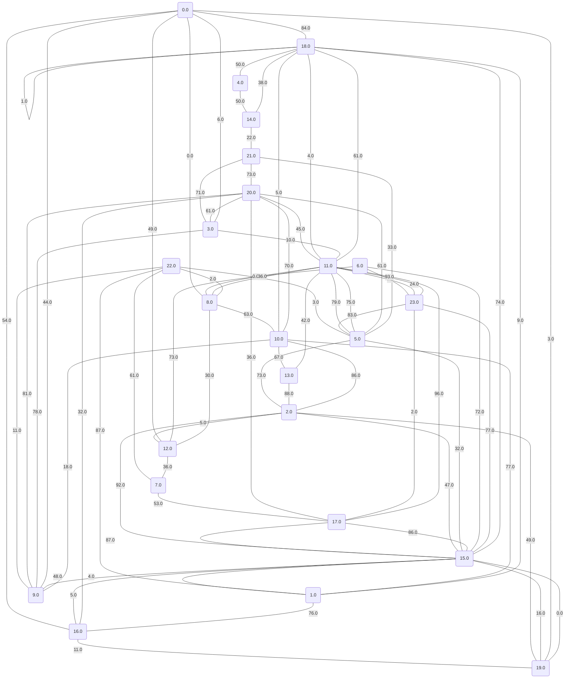

```mermaid
graph TD;
	0("0.0");
	1("1.0");
	2("2.0");
	3("3.0");
	4("4.0");
	5("5.0");
	6("6.0");
	7("7.0");
	8("8.0");
	9("9.0");
	10("10.0");
	11("11.0");
	12("12.0");
	13("13.0");
	14("14.0");
	15("15.0");
	16("16.0");
	17("17.0");
	18("18.0");
	19("19.0");
	20("20.0");
	21("21.0");
	22("22.0");
	23("23.0");
	3 -- "6.0" --- 0;
	20 -- "45.0" --- 11;
	4 -- "50.0" --- 14;
	8 -- "63.0" --- 10;
	0 -- "84.0" --- 18;
	2 -- "5.0" --- 12;
	22 -- "11.0" --- 9;
	21 -- "73.0" --- 20;
	17 -- "87.0" --- 15;
	22 -- "61.0" --- 7;
	22 -- "3.0" --- 5;
	14 -- "38.0" --- 18;
	15 -- "4.0" --- 1;
	23 -- "83.0" --- 5;
	5 -- "61.0" --- 20;
	0 -- "0.0" --- 8;
	13 -- "42.0" --- 11;
	5 -- "73.0" --- 2;
	2 -- "92.0" --- 15;
	21 -- "71.0" --- 3;
	13 -- "88.0" --- 2;
	11 -- "0.0" --- 8;
	11 -- "61.0" --- 18;
	0 -- "54.0" --- 16;
	7 -- "53.0" --- 17;
	18 -- "50.0" --- 4;
	10 -- "70.0" --- 20;
	18 -- "5.0" --- 10;
	20 -- "81.0" --- 9;
	2 -- "47.0" --- 15;
	11 -- "36.0" --- 8;
	9 -- "18.0" --- 10;
	1 -- "77.0" --- 10;
	14 -- "22.0" --- 21;
	18 -- "4.0" --- 11;
	12 -- "30.0" --- 8;
	22 -- "87.0" --- 1;
	3 -- "78.0" --- 9;
	10 -- "86.0" --- 2;
	12 -- "36.0" --- 7;
	5 -- "32.0" --- 15;
	20 -- "36.0" --- 17;
	17 -- "86.0" --- 15;
	0 -- "49.0" --- 12;
	16 -- "11.0" --- 19;
	5 -- "33.0" --- 21;
	15 -- "5.0" --- 16;
	6 -- "72.0" --- 15;
	11 -- "79.0" --- 5;
	2 -- "49.0" --- 19;
	6 -- "73.0" --- 12;
	3 -- "10.0" --- 11;
	23 -- "77.0" --- 15;
	11 -- "75.0" --- 5;
	20 -- "61.0" --- 3;
	23 -- "2.0" --- 17;
	0 -- "44.0" --- 9;
	15 -- "16.0" --- 19;
	11 -- "96.0" --- 17;
	15 -- "74.0" --- 18;
	22 -- "2.0" --- 8;
	10 -- "67.0" --- 13;
	19 -- "0.0" --- 15;
	15 -- "48.0" --- 9;
	0 -- "3.0" --- 19;
	20 -- "32.0" --- 16;
	6 -- "7.0" --- 23;
	11 -- "24.0" --- 23;
	23 -- "93.0" --- 11;
	1 -- "9.0" --- 18;
	18 -- "1.0" --- 18;
	1 -- "76.0" --- 16;
```

