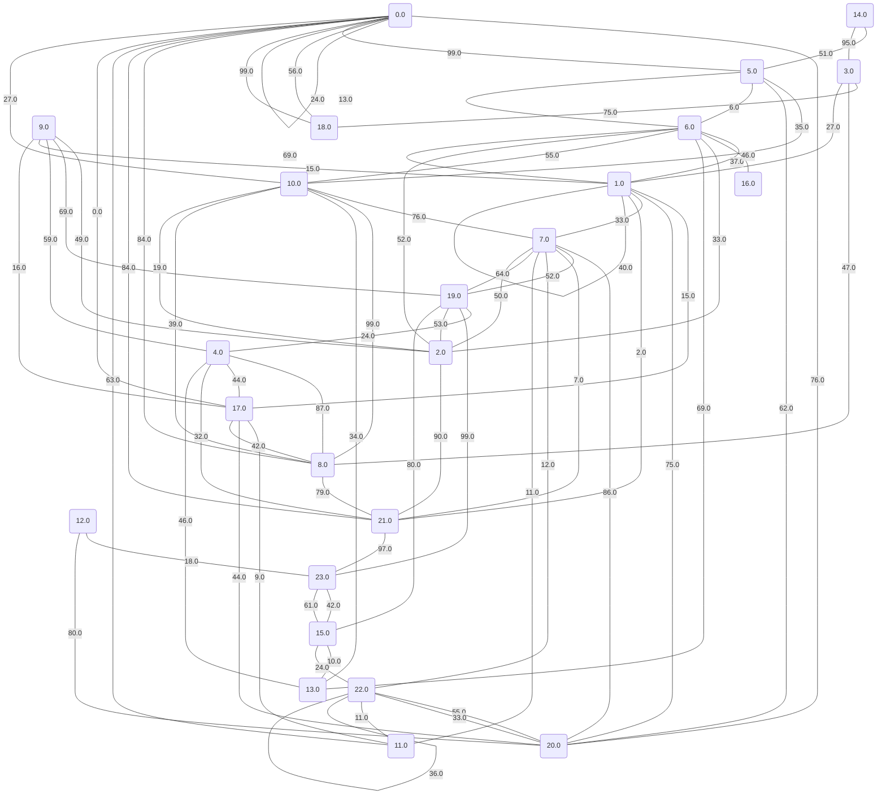

```mermaid
graph TD;
	0("0.0");
	1("1.0");
	2("2.0");
	3("3.0");
	4("4.0");
	5("5.0");
	6("6.0");
	7("7.0");
	8("8.0");
	9("9.0");
	10("10.0");
	11("11.0");
	12("12.0");
	13("13.0");
	14("14.0");
	15("15.0");
	16("16.0");
	17("17.0");
	18("18.0");
	19("19.0");
	20("20.0");
	21("21.0");
	22("22.0");
	23("23.0");
	0 -- "76.0" --- 20;
	1 -- "15.0" --- 17;
	6 -- "37.0" --- 1;
	7 -- "86.0" --- 20;
	6 -- "46.0" --- 16;
	2 -- "90.0" --- 21;
	8 -- "99.0" --- 10;
	15 -- "80.0" --- 19;
	15 -- "10.0" --- 13;
	14 -- "51.0" --- 5;
	5 -- "35.0" --- 10;
	17 -- "9.0" --- 11;
	6 -- "33.0" --- 2;
	13 -- "34.0" --- 10;
	22 -- "12.0" --- 7;
	21 -- "84.0" --- 0;
	8 -- "84.0" --- 0;
	13 -- "46.0" --- 4;
	21 -- "32.0" --- 4;
	0 -- "24.0" --- 0;
	12 -- "18.0" --- 23;
	1 -- "69.0" --- 6;
	8 -- "79.0" --- 21;
	1 -- "75.0" --- 20;
	14 -- "95.0" --- 3;
	5 -- "62.0" --- 20;
	5 -- "6.0" --- 6;
	7 -- "52.0" --- 19;
	3 -- "75.0" --- 18;
	11 -- "63.0" --- 0;
	4 -- "87.0" --- 8;
	2 -- "50.0" --- 7;
	22 -- "55.0" --- 20;
	22 -- "33.0" --- 20;
	3 -- "47.0" --- 8;
	11 -- "11.0" --- 7;
	1 -- "33.0" --- 7;
	0 -- "56.0" --- 18;
	19 -- "24.0" --- 4;
	17 -- "44.0" --- 20;
	7 -- "7.0" --- 21;
	10 -- "76.0" --- 7;
	9 -- "49.0" --- 2;
	18 -- "99.0" --- 0;
	22 -- "11.0" --- 11;
	0 -- "99.0" --- 5;
	15 -- "24.0" --- 22;
	3 -- "27.0" --- 1;
	17 -- "42.0" --- 8;
	23 -- "42.0" --- 15;
	17 -- "0.0" --- 0;
	6 -- "69.0" --- 13;
	19 -- "64.0" --- 7;
	19 -- "99.0" --- 23;
	4 -- "44.0" --- 17;
	22 -- "36.0" --- 22;
	8 -- "39.0" --- 10;
	9 -- "69.0" --- 19;
	10 -- "27.0" --- 0;
	9 -- "59.0" --- 4;
	12 -- "80.0" --- 20;
	6 -- "13.0" --- 5;
	1 -- "2.0" --- 21;
	2 -- "19.0" --- 10;
	6 -- "55.0" --- 10;
	19 -- "53.0" --- 2;
	1 -- "40.0" --- 1;
	9 -- "15.0" --- 1;
	15 -- "61.0" --- 23;
	6 -- "52.0" --- 2;
	21 -- "97.0" --- 23;
	9 -- "16.0" --- 17;
```

