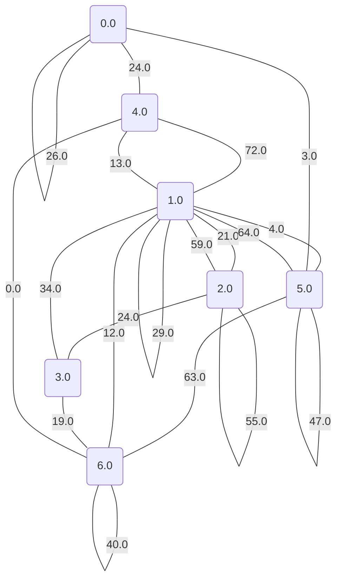

```mermaid
graph TD;
	0("0.0");
	1("1.0");
	2("2.0");
	3("3.0");
	4("4.0");
	5("5.0");
	6("6.0");
	2 -- "55.0" --- 2;
	4 -- "72.0" --- 1;
	5 -- "47.0" --- 5;
	5 -- "3.0" --- 0;
	3 -- "34.0" --- 1;
	1 -- "4.0" --- 5;
	5 -- "63.0" --- 6;
	1 -- "12.0" --- 6;
	0 -- "95.0" --- 0;
	0 -- "26.0" --- 0;
	6 -- "38.0" --- 6;
	0 -- "24.0" --- 4;
	1 -- "13.0" --- 4;
	1 -- "21.0" --- 2;
	6 -- "0.0" --- 4;
	3 -- "19.0" --- 6;
	1 -- "29.0" --- 1;
	2 -- "59.0" --- 1;
	6 -- "40.0" --- 6;
	2 -- "24.0" --- 3;
	5 -- "64.0" --- 1;
```

