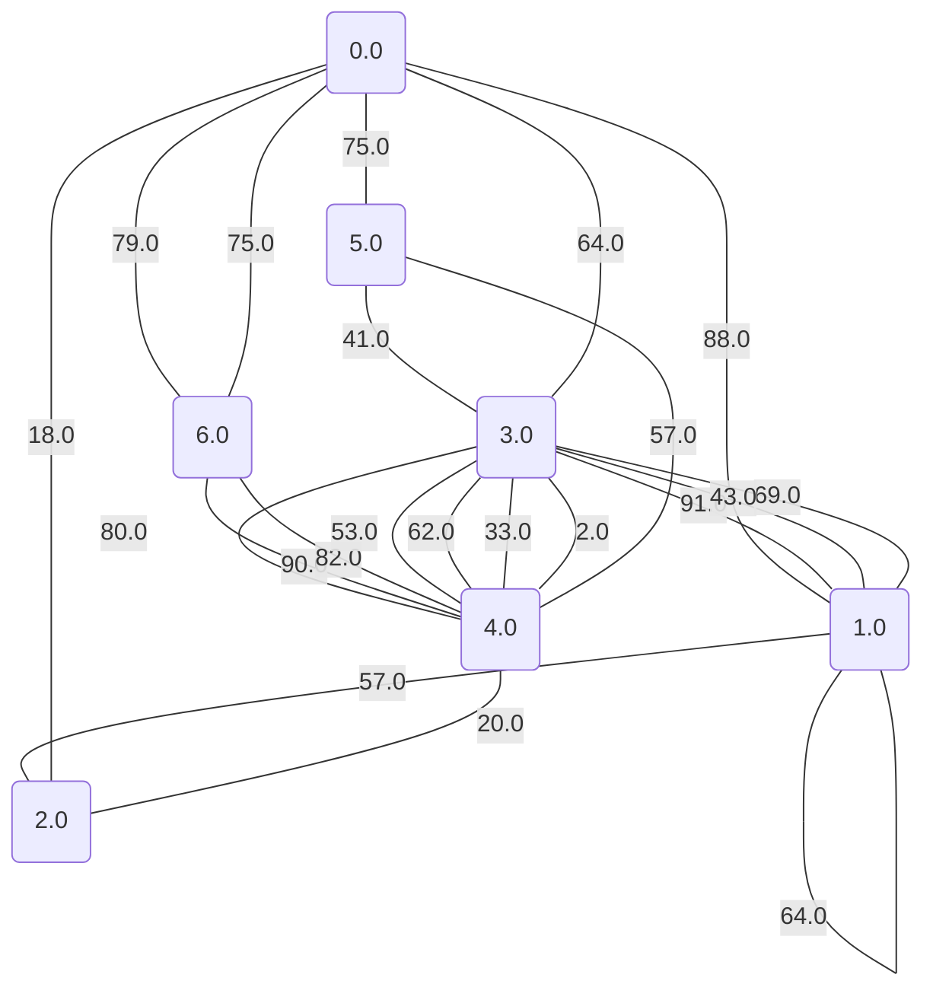

```mermaid
graph TD;
	0("0.0");
	1("1.0");
	2("2.0");
	3("3.0");
	4("4.0");
	5("5.0");
	6("6.0");
	4 -- "33.0" --- 3;
	1 -- "69.0" --- 3;
	6 -- "75.0" --- 0;
	3 -- "80.0" --- 4;
	0 -- "75.0" --- 5;
	1 -- "57.0" --- 2;
	6 -- "90.0" --- 4;
	0 -- "18.0" --- 2;
	6 -- "82.0" --- 4;
	3 -- "64.0" --- 0;
	0 -- "79.0" --- 6;
	3 -- "53.0" --- 4;
	4 -- "2.0" --- 3;
	3 -- "62.0" --- 4;
	4 -- "57.0" --- 5;
	0 -- "88.0" --- 1;
	1 -- "64.0" --- 1;
	3 -- "91.0" --- 1;
	3 -- "43.0" --- 1;
	5 -- "41.0" --- 3;
	4 -- "20.0" --- 2;
```

