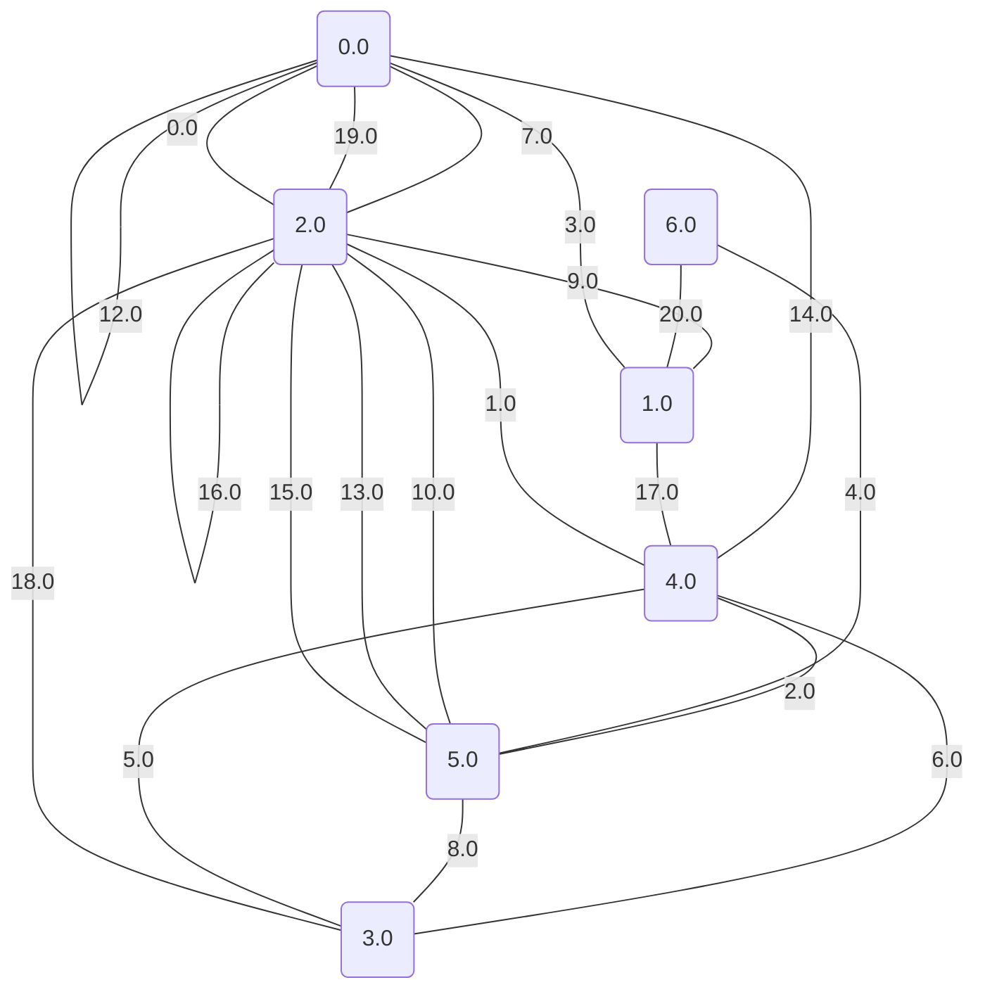

```mermaid
graph TD;
0("0.0");
1("1.0");
2("2.0");
3("3.0");
4("4.0");
5("5.0");
6("6.0");
	2 -- "0.0" --- 0;
	4 -- "1.0" --- 2;
	4 -- "2.0" --- 5;
	1 -- "3.0" --- 0;
	6 -- "4.0" --- 5;
	3 -- "5.0" --- 4;
	4 -- "6.0" --- 3;
	0 -- "7.0" --- 2;
	5 -- "8.0" --- 3;
	2 -- "9.0" --- 1;
	2 -- "10.0" --- 5;
	0 -- "11.0" --- 0;
	0 -- "12.0" --- 0;
	5 -- "13.0" --- 2;
	0 -- "14.0" --- 4;
	5 -- "15.0" --- 2;
	2 -- "16.0" --- 2;
	1 -- "17.0" --- 4;
	3 -- "18.0" --- 2;
	0 -- "19.0" --- 2;
	6 -- "20.0" --- 1;
```
