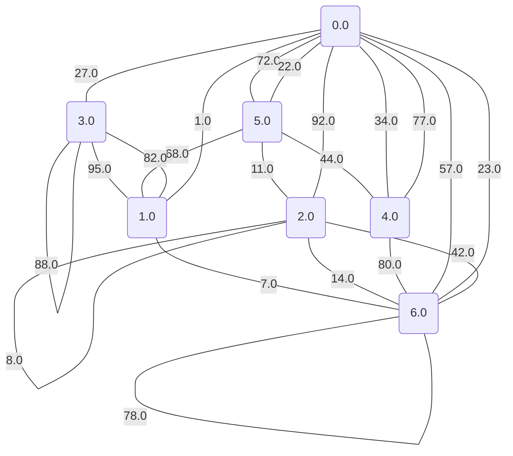

```mermaid
graph TD;
	0("0.0");
	1("1.0");
	2("2.0");
	3("3.0");
	4("4.0");
	5("5.0");
	6("6.0");
	0 -- "72.0" --- 5;
	5 -- "22.0" --- 0;
	3 -- "88.0" --- 3;
	5 -- "11.0" --- 2;
	1 -- "1.0" --- 0;
	4 -- "77.0" --- 0;
	2 -- "8.0" --- 2;
	1 -- "7.0" --- 6;
	3 -- "95.0" --- 1;
	6 -- "57.0" --- 0;
	6 -- "23.0" --- 0;
	5 -- "68.0" --- 1;
	0 -- "27.0" --- 3;
	6 -- "42.0" --- 2;
	5 -- "44.0" --- 4;
	2 -- "14.0" --- 6;
	3 -- "82.0" --- 1;
	4 -- "80.0" --- 6;
	0 -- "34.0" --- 4;
	2 -- "92.0" --- 0;
	6 -- "78.0" --- 6;
```

