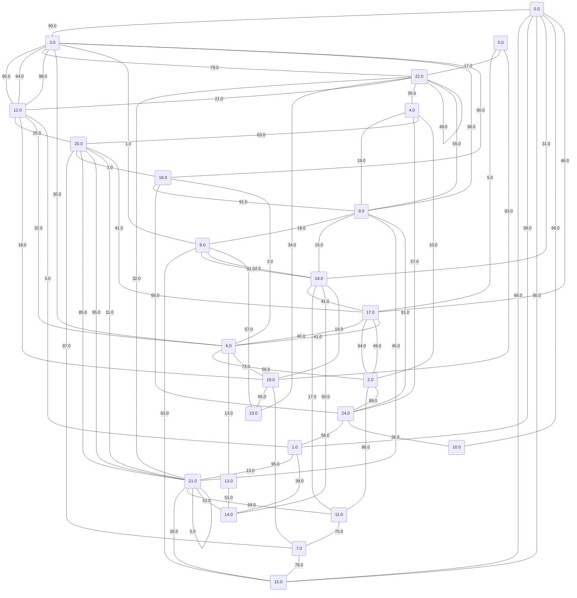

```mermaid
graph TD;
	0("0.0");
	1("1.0");
	2("2.0");
	3("3.0");
	4("4.0");
	5("5.0");
	6("6.0");
	7("7.0");
	8("8.0");
	9("9.0");
	10("10.0");
	11("11.0");
	12("12.0");
	13("13.0");
	14("14.0");
	15("15.0");
	16("16.0");
	17("17.0");
	18("18.0");
	19("19.0");
	20("20.0");
	21("21.0");
	22("22.0");
	23("23.0");
	24("24.0");
	3 -- "66.0" --- 12;
	22 -- "32.0" --- 21;
	4 -- "19.0" --- 9;
	7 -- "79.0" --- 15;
	4 -- "57.0" --- 24;
	18 -- "12.0" --- 8;
	17 -- "40.0" --- 6;
	12 -- "25.0" --- 20;
	20 -- "97.0" --- 7;
	8 -- "1.0" --- 3;
	9 -- "18.0" --- 8;
	22 -- "34.0" --- 23;
	3 -- "64.0" --- 12;
	2 -- "88.0" --- 11;
	3 -- "79.0" --- 22;
	9 -- "15.0" --- 18;
	3 -- "88.0" --- 12;
	0 -- "90.0" --- 3;
	8 -- "63.0" --- 15;
	22 -- "21.0" --- 12;
	24 -- "56.0" --- 1;
	21 -- "95.0" --- 20;
	17 -- "46.0" --- 0;
	20 -- "1.0" --- 16;
	9 -- "45.0" --- 21;
	6 -- "56.0" --- 2;
	16 -- "91.0" --- 9;
	16 -- "90.0" --- 3;
	21 -- "26.0" --- 15;
	5 -- "5.0" --- 17;
	18 -- "31.0" --- 0;
	12 -- "18.0" --- 19;
	21 -- "11.0" --- 20;
	24 -- "91.0" --- 9;
	5 -- "17.0" --- 22;
	4 -- "63.0" --- 20;
	18 -- "41.0" --- 17;
	16 -- "66.0" --- 24;
	5 -- "83.0" --- 19;
	21 -- "89.0" --- 11;
	13 -- "51.0" --- 14;
	19 -- "19.0" --- 18;
	0 -- "66.0" --- 15;
	3 -- "30.0" --- 6;
	19 -- "65.0" --- 23;
	0 -- "58.0" --- 1;
	14 -- "39.0" --- 1;
	18 -- "17.0" --- 11;
	2 -- "49.0" --- 17;
	8 -- "91.0" --- 18;
	17 -- "94.0" --- 2;
	20 -- "85.0" --- 21;
	19 -- "95.0" --- 7;
	22 -- "55.0" --- 4;
	21 -- "5.0" --- 21;
	9 -- "38.0" --- 3;
	16 -- "2.0" --- 6;
	21 -- "51.0" --- 14;
	4 -- "10.0" --- 2;
	6 -- "13.0" --- 13;
	24 -- "26.0" --- 10;
	2 -- "89.0" --- 24;
	22 -- "49.0" --- 22;
	1 -- "5.0" --- 12;
	23 -- "57.0" --- 8;
	10 -- "66.0" --- 0;
	12 -- "32.0" --- 6;
	1 -- "13.0" --- 21;
	6 -- "41.0" --- 17;
	15 -- "95.0" --- 0;
	17 -- "41.0" --- 20;
	14 -- "50.0" --- 18;
	6 -- "73.0" --- 19;
	22 -- "55.0" --- 9;
	11 -- "75.0" --- 7;
```

