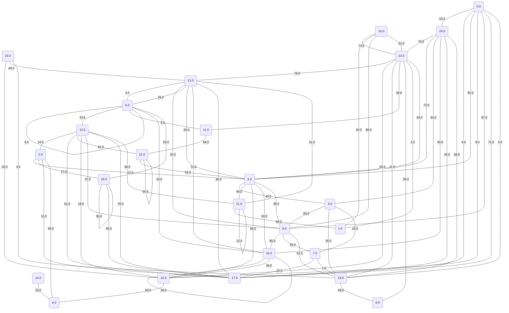

```mermaid
graph TD;
	0("0.0");
	1("1.0");
	2("2.0");
	3("3.0");
	4("4.0");
	5("5.0");
	6("6.0");
	7("7.0");
	8("8.0");
	9("9.0");
	10("10.0");
	11("11.0");
	12("12.0");
	13("13.0");
	14("14.0");
	15("15.0");
	16("16.0");
	17("17.0");
	18("18.0");
	19("19.0");
	20("20.0");
	21("21.0");
	22("22.0");
	23("23.0");
	24("24.0");
	23 -- "79.0" --- 13;
	13 -- "4.0" --- 6;
	3 -- "83.0" --- 8;
	3 -- "35.0" --- 19;
	6 -- "5.0" --- 6;
	17 -- "30.0" --- 24;
	16 -- "74.0" --- 23;
	21 -- "98.0" --- 12;
	15 -- "18.0" --- 12;
	8 -- "85.0" --- 10;
	13 -- "20.0" --- 8;
	20 -- "20.0" --- 15;
	23 -- "55.0" --- 15;
	10 -- "72.0" --- 13;
	1 -- "2.0" --- 23;
	22 -- "55.0" --- 5;
	21 -- "69.0" --- 1;
	23 -- "11.0" --- 19;
	5 -- "69.0" --- 13;
	0 -- "52.0" --- 24;
	12 -- "14.0" --- 2;
	18 -- "93.0" --- 18;
	8 -- "39.0" --- 5;
	10 -- "19.0" --- 6;
	7 -- "19.0" --- 3;
	9 -- "36.0" --- 23;
	17 -- "70.0" --- 12;
	10 -- "40.0" --- 24;
	23 -- "36.0" --- 11;
	15 -- "9.0" --- 0;
	24 -- "70.0" --- 23;
	10 -- "60.0" --- 10;
	2 -- "21.0" --- 5;
	24 -- "72.0" --- 5;
	7 -- "24.0" --- 17;
	19 -- "4.0" --- 0;
	4 -- "69.0" --- 2;
	2 -- "17.0" --- 18;
	8 -- "37.0" --- 12;
	18 -- "93.0" --- 6;
	19 -- "58.0" --- 24;
	14 -- "33.0" --- 4;
	12 -- "61.0" --- 17;
	20 -- "64.0" --- 13;
	10 -- "46.0" --- 15;
	21 -- "12.0" --- 21;
	5 -- "40.0" --- 3;
	13 -- "29.0" --- 6;
	0 -- "9.0" --- 17;
	18 -- "60.0" --- 17;
	24 -- "44.0" --- 3;
	8 -- "67.0" --- 0;
	5 -- "44.0" --- 21;
	6 -- "33.0" --- 12;
	15 -- "26.0" --- 4;
	15 -- "58.0" --- 5;
	21 -- "51.0" --- 13;
	17 -- "36.0" --- 13;
	22 -- "55.0" --- 22;
	16 -- "34.0" --- 1;
	5 -- "64.0" --- 23;
	19 -- "61.0" --- 8;
	17 -- "71.0" --- 0;
	8 -- "93.0" --- 7;
	11 -- "58.0" --- 22;
	7 -- "1.0" --- 19;
	19 -- "48.0" --- 9;
	0 -- "92.0" --- 5;
	10 -- "93.0" --- 5;
	16 -- "88.0" --- 8;
	6 -- "0.0" --- 11;
	20 -- "3.0" --- 19;
	2 -- "11.0" --- 17;
	16 -- "52.0" --- 23;
	12 -- "81.0" --- 22;
```

