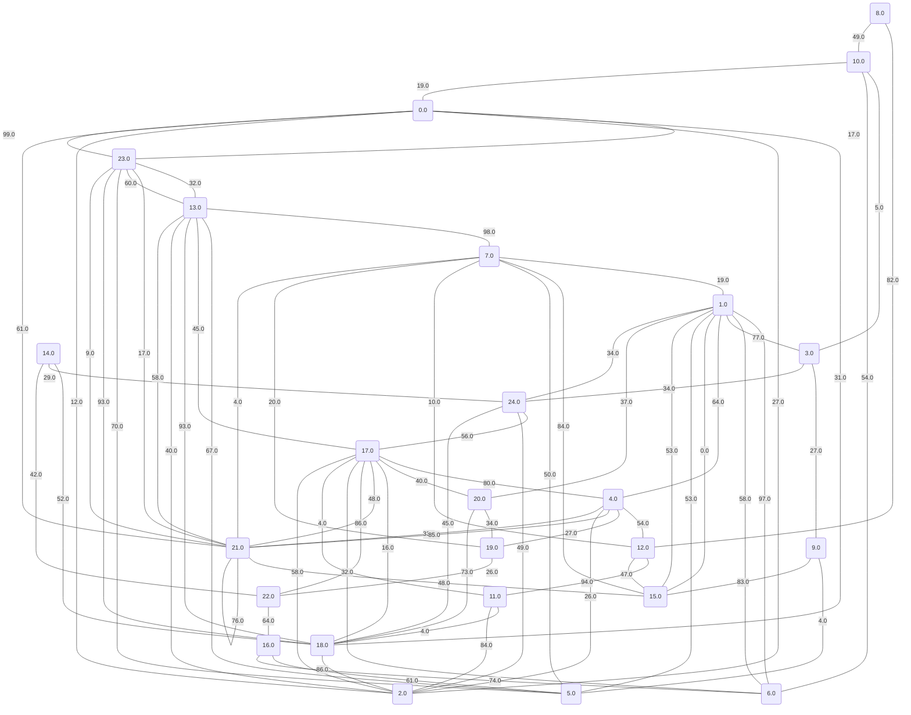

```mermaid
graph TD;
	0("0.0");
	1("1.0");
	2("2.0");
	3("3.0");
	4("4.0");
	5("5.0");
	6("6.0");
	7("7.0");
	8("8.0");
	9("9.0");
	10("10.0");
	11("11.0");
	12("12.0");
	13("13.0");
	14("14.0");
	15("15.0");
	16("16.0");
	17("17.0");
	18("18.0");
	19("19.0");
	20("20.0");
	21("21.0");
	22("22.0");
	23("23.0");
	24("24.0");
	21 -- "48.0" --- 15;
	4 -- "54.0" --- 12;
	16 -- "61.0" --- 5;
	24 -- "56.0" --- 17;
	17 -- "80.0" --- 4;
	0 -- "17.0" --- 23;
	21 -- "61.0" --- 0;
	12 -- "10.0" --- 7;
	10 -- "5.0" --- 3;
	24 -- "49.0" --- 2;
	11 -- "4.0" --- 17;
	19 -- "20.0" --- 7;
	13 -- "98.0" --- 7;
	8 -- "82.0" --- 12;
	17 -- "40.0" --- 20;
	3 -- "27.0" --- 9;
	1 -- "97.0" --- 6;
	2 -- "27.0" --- 0;
	2 -- "40.0" --- 13;
	18 -- "93.0" --- 13;
	10 -- "54.0" --- 6;
	7 -- "19.0" --- 1;
	2 -- "84.0" --- 11;
	23 -- "32.0" --- 13;
	21 -- "58.0" --- 13;
	18 -- "93.0" --- 23;
	24 -- "34.0" --- 1;
	17 -- "16.0" --- 18;
	10 -- "19.0" --- 0;
	5 -- "70.0" --- 23;
	7 -- "84.0" --- 15;
	14 -- "52.0" --- 18;
	15 -- "53.0" --- 1;
	23 -- "17.0" --- 21;
	5 -- "53.0" --- 1;
	2 -- "12.0" --- 0;
	8 -- "49.0" --- 10;
	23 -- "99.0" --- 0;
	21 -- "33.0" --- 4;
	20 -- "34.0" --- 19;
	13 -- "67.0" --- 5;
	14 -- "29.0" --- 24;
	9 -- "4.0" --- 5;
	17 -- "48.0" --- 21;
	12 -- "94.0" --- 11;
	21 -- "4.0" --- 7;
	23 -- "60.0" --- 13;
	17 -- "86.0" --- 22;
	0 -- "31.0" --- 18;
	9 -- "83.0" --- 15;
	1 -- "58.0" --- 6;
	1 -- "77.0" --- 3;
	14 -- "42.0" --- 22;
	17 -- "32.0" --- 6;
	4 -- "27.0" --- 19;
	22 -- "64.0" --- 16;
	7 -- "50.0" --- 5;
	21 -- "9.0" --- 23;
	18 -- "45.0" --- 24;
	2 -- "58.0" --- 17;
	20 -- "37.0" --- 1;
	3 -- "34.0" --- 24;
	20 -- "73.0" --- 18;
	19 -- "26.0" --- 22;
	1 -- "64.0" --- 4;
	2 -- "26.0" --- 4;
	21 -- "4.0" --- 21;
	12 -- "47.0" --- 15;
	11 -- "4.0" --- 18;
	18 -- "86.0" --- 2;
	13 -- "45.0" --- 17;
	21 -- "76.0" --- 21;
	1 -- "0.0" --- 15;
	4 -- "85.0" --- 21;
	16 -- "74.0" --- 6;
```

