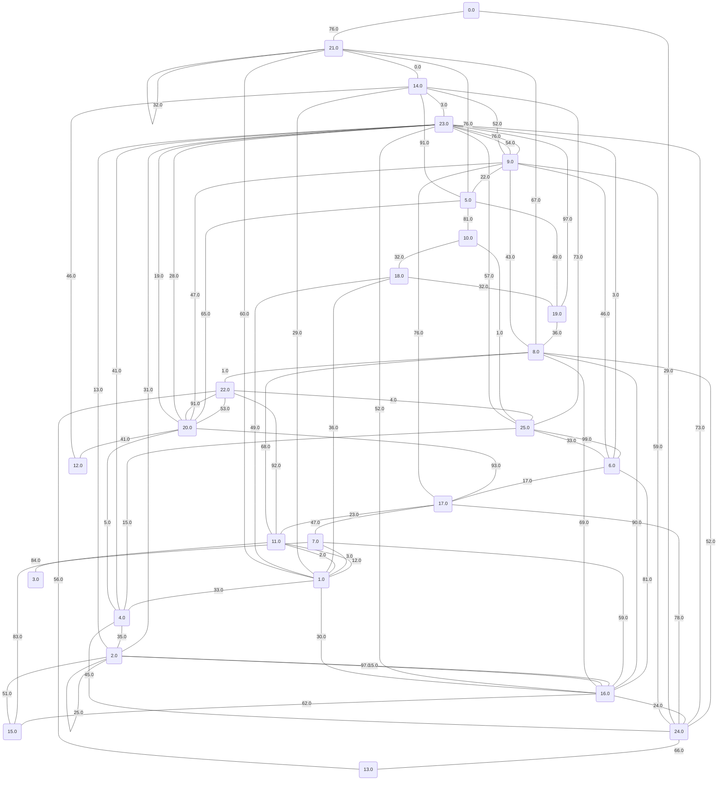

```mermaid
graph TD;
	0("0.0");
	1("1.0");
	2("2.0");
	3("3.0");
	4("4.0");
	5("5.0");
	6("6.0");
	7("7.0");
	8("8.0");
	9("9.0");
	10("10.0");
	11("11.0");
	12("12.0");
	13("13.0");
	14("14.0");
	15("15.0");
	16("16.0");
	17("17.0");
	18("18.0");
	19("19.0");
	20("20.0");
	21("21.0");
	22("22.0");
	23("23.0");
	24("24.0");
	25("25.0");
	21 -- "0.0" --- 14;
	5 -- "81.0" --- 10;
	6 -- "81.0" --- 16;
	8 -- "1.0" --- 22;
	1 -- "36.0" --- 18;
	24 -- "78.0" --- 17;
	20 -- "91.0" --- 22;
	14 -- "3.0" --- 23;
	20 -- "41.0" --- 12;
	8 -- "67.0" --- 21;
	11 -- "84.0" --- 3;
	11 -- "92.0" --- 22;
	17 -- "23.0" --- 11;
	23 -- "76.0" --- 9;
	20 -- "28.0" --- 23;
	8 -- "43.0" --- 9;
	23 -- "97.0" --- 19;
	23 -- "31.0" --- 2;
	8 -- "52.0" --- 24;
	10 -- "32.0" --- 18;
	24 -- "29.0" --- 0;
	23 -- "54.0" --- 9;
	21 -- "32.0" --- 21;
	6 -- "17.0" --- 17;
	13 -- "56.0" --- 22;
	9 -- "22.0" --- 5;
	1 -- "33.0" --- 4;
	16 -- "62.0" --- 15;
	24 -- "59.0" --- 9;
	1 -- "29.0" --- 14;
	8 -- "90.0" --- 16;
	16 -- "52.0" --- 23;
	22 -- "53.0" --- 20;
	1 -- "49.0" --- 18;
	4 -- "5.0" --- 20;
	25 -- "99.0" --- 6;
	11 -- "3.0" --- 1;
	25 -- "15.0" --- 4;
	24 -- "66.0" --- 13;
	17 -- "76.0" --- 9;
	6 -- "46.0" --- 9;
	7 -- "59.0" --- 16;
	2 -- "15.0" --- 16;
	23 -- "41.0" --- 4;
	19 -- "36.0" --- 8;
	23 -- "3.0" --- 6;
	4 -- "35.0" --- 2;
	20 -- "93.0" --- 17;
	5 -- "65.0" --- 20;
	7 -- "12.0" --- 1;
	25 -- "1.0" --- 10;
	2 -- "25.0" --- 2;
	21 -- "76.0" --- 5;
	2 -- "97.0" --- 16;
	0 -- "76.0" --- 21;
	5 -- "49.0" --- 19;
	9 -- "47.0" --- 20;
	23 -- "13.0" --- 2;
	23 -- "73.0" --- 24;
	18 -- "32.0" --- 19;
	9 -- "52.0" --- 14;
	15 -- "51.0" --- 2;
	14 -- "73.0" --- 25;
	25 -- "57.0" --- 23;
	5 -- "91.0" --- 14;
	11 -- "2.0" --- 1;
	16 -- "30.0" --- 1;
	14 -- "46.0" --- 12;
	8 -- "69.0" --- 16;
	16 -- "24.0" --- 24;
	6 -- "33.0" --- 25;
	1 -- "60.0" --- 21;
	17 -- "47.0" --- 7;
	24 -- "45.0" --- 4;
	20 -- "19.0" --- 23;
	7 -- "83.0" --- 15;
	22 -- "4.0" --- 25;
	11 -- "68.0" --- 8;
```

