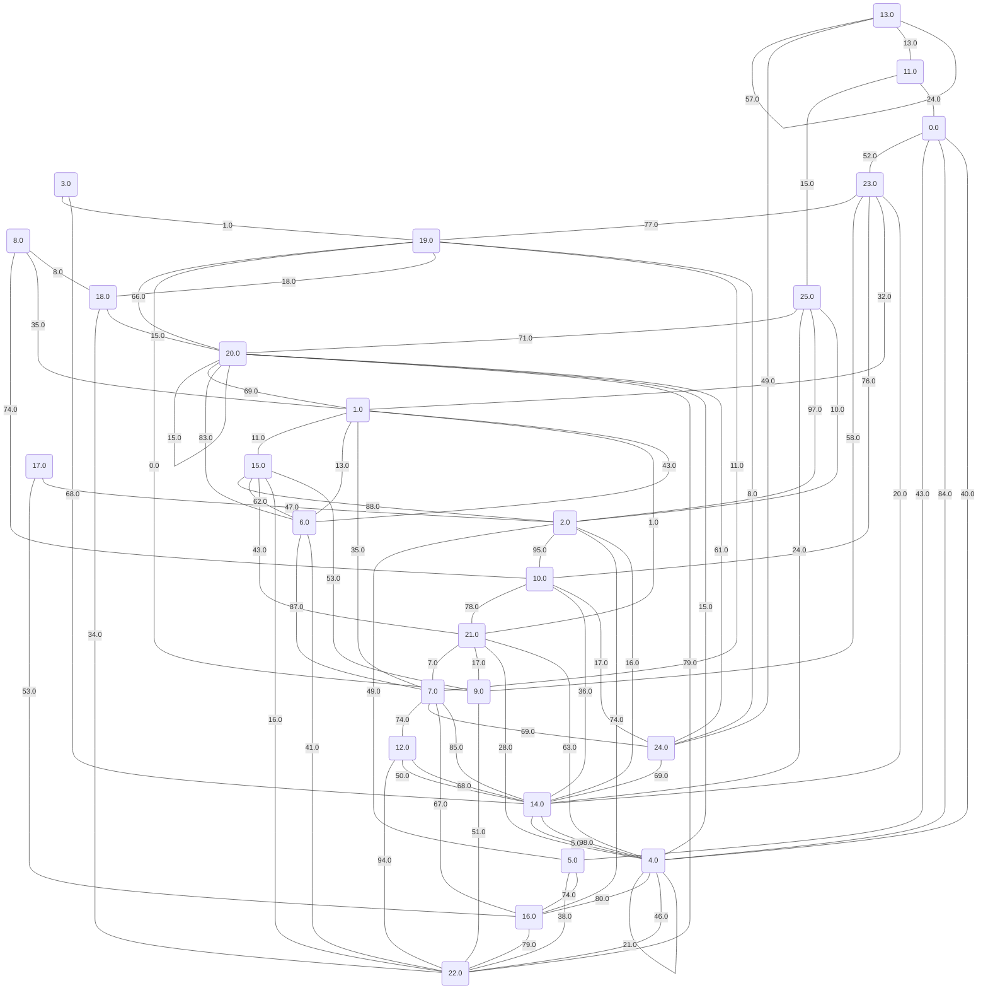

```mermaid
graph TD;
	0("0.0");
	1("1.0");
	2("2.0");
	3("3.0");
	4("4.0");
	5("5.0");
	6("6.0");
	7("7.0");
	8("8.0");
	9("9.0");
	10("10.0");
	11("11.0");
	12("12.0");
	13("13.0");
	14("14.0");
	15("15.0");
	16("16.0");
	17("17.0");
	18("18.0");
	19("19.0");
	20("20.0");
	21("21.0");
	22("22.0");
	23("23.0");
	24("24.0");
	25("25.0");
	3 -- "1.0" --- 19;
	4 -- "28.0" --- 21;
	7 -- "74.0" --- 12;
	13 -- "57.0" --- 13;
	20 -- "15.0" --- 20;
	25 -- "71.0" --- 20;
	16 -- "79.0" --- 22;
	24 -- "17.0" --- 10;
	12 -- "94.0" --- 22;
	24 -- "61.0" --- 20;
	15 -- "88.0" --- 2;
	8 -- "74.0" --- 10;
	4 -- "98.0" --- 14;
	25 -- "24.0" --- 14;
	4 -- "84.0" --- 0;
	11 -- "15.0" --- 25;
	15 -- "62.0" --- 6;
	23 -- "77.0" --- 19;
	19 -- "66.0" --- 20;
	14 -- "20.0" --- 23;
	11 -- "24.0" --- 0;
	21 -- "7.0" --- 7;
	8 -- "35.0" --- 1;
	0 -- "52.0" --- 23;
	7 -- "11.0" --- 19;
	0 -- "43.0" --- 5;
	17 -- "53.0" --- 16;
	25 -- "97.0" --- 2;
	9 -- "51.0" --- 22;
	7 -- "69.0" --- 24;
	22 -- "16.0" --- 15;
	2 -- "49.0" --- 5;
	5 -- "38.0" --- 22;
	20 -- "69.0" --- 1;
	14 -- "16.0" --- 2;
	7 -- "67.0" --- 16;
	21 -- "1.0" --- 1;
	21 -- "17.0" --- 9;
	19 -- "0.0" --- 9;
	4 -- "21.0" --- 4;
	22 -- "79.0" --- 20;
	6 -- "87.0" --- 7;
	10 -- "78.0" --- 21;
	3 -- "68.0" --- 14;
	23 -- "58.0" --- 9;
	6 -- "43.0" --- 1;
	24 -- "8.0" --- 19;
	13 -- "49.0" --- 24;
	14 -- "5.0" --- 4;
	1 -- "32.0" --- 23;
	8 -- "8.0" --- 18;
	1 -- "11.0" --- 15;
	18 -- "34.0" --- 22;
	4 -- "80.0" --- 16;
	19 -- "18.0" --- 18;
	14 -- "85.0" --- 7;
	4 -- "63.0" --- 21;
	13 -- "13.0" --- 11;
	24 -- "69.0" --- 14;
	4 -- "40.0" --- 0;
	14 -- "36.0" --- 10;
	12 -- "50.0" --- 14;
	18 -- "15.0" --- 20;
	7 -- "35.0" --- 1;
	9 -- "53.0" --- 15;
	23 -- "76.0" --- 10;
	6 -- "41.0" --- 22;
	15 -- "43.0" --- 21;
	2 -- "95.0" --- 10;
	20 -- "83.0" --- 6;
	4 -- "15.0" --- 20;
	5 -- "74.0" --- 16;
	4 -- "46.0" --- 22;
	1 -- "13.0" --- 6;
	17 -- "47.0" --- 2;
	2 -- "74.0" --- 16;
	12 -- "68.0" --- 14;
	25 -- "10.0" --- 2;
```

