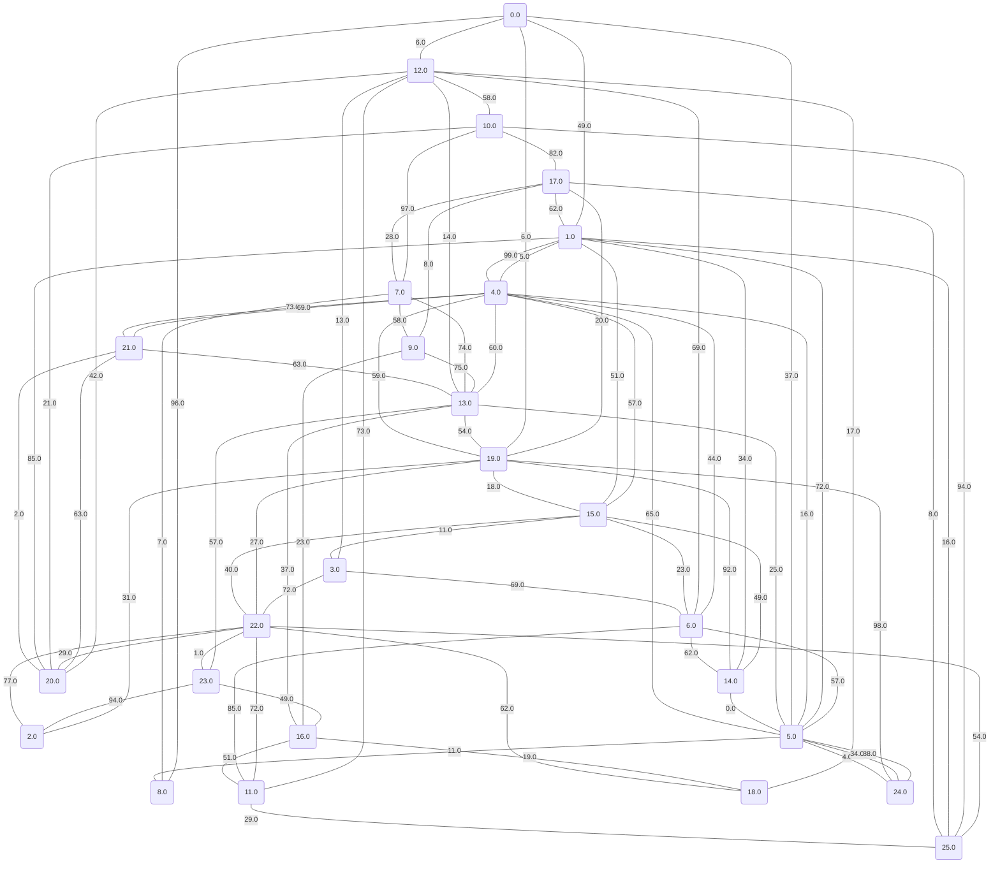

```mermaid
graph TD;
	0("0.0");
	1("1.0");
	2("2.0");
	3("3.0");
	4("4.0");
	5("5.0");
	6("6.0");
	7("7.0");
	8("8.0");
	9("9.0");
	10("10.0");
	11("11.0");
	12("12.0");
	13("13.0");
	14("14.0");
	15("15.0");
	16("16.0");
	17("17.0");
	18("18.0");
	19("19.0");
	20("20.0");
	21("21.0");
	22("22.0");
	23("23.0");
	24("24.0");
	25("25.0");
	21 -- "63.0" --- 13;
	6 -- "62.0" --- 14;
	4 -- "59.0" --- 19;
	22 -- "1.0" --- 23;
	15 -- "40.0" --- 22;
	10 -- "82.0" --- 17;
	13 -- "54.0" --- 19;
	12 -- "58.0" --- 10;
	14 -- "34.0" --- 1;
	22 -- "62.0" --- 18;
	5 -- "11.0" --- 8;
	19 -- "27.0" --- 22;
	20 -- "42.0" --- 12;
	19 -- "18.0" --- 15;
	21 -- "2.0" --- 20;
	5 -- "37.0" --- 0;
	3 -- "69.0" --- 6;
	11 -- "29.0" --- 25;
	0 -- "6.0" --- 12;
	13 -- "60.0" --- 4;
	4 -- "65.0" --- 5;
	15 -- "23.0" --- 6;
	7 -- "7.0" --- 8;
	12 -- "69.0" --- 6;
	13 -- "57.0" --- 23;
	15 -- "57.0" --- 4;
	9 -- "8.0" --- 17;
	1 -- "85.0" --- 20;
	11 -- "72.0" --- 22;
	4 -- "73.0" --- 21;
	1 -- "99.0" --- 4;
	16 -- "19.0" --- 18;
	17 -- "8.0" --- 25;
	17 -- "62.0" --- 1;
	1 -- "16.0" --- 25;
	0 -- "6.0" --- 19;
	21 -- "69.0" --- 4;
	7 -- "58.0" --- 9;
	5 -- "4.0" --- 24;
	17 -- "20.0" --- 19;
	19 -- "98.0" --- 24;
	4 -- "5.0" --- 1;
	11 -- "73.0" --- 12;
	14 -- "49.0" --- 15;
	22 -- "77.0" --- 2;
	13 -- "37.0" --- 16;
	5 -- "16.0" --- 4;
	5 -- "72.0" --- 1;
	10 -- "94.0" --- 25;
	5 -- "34.0" --- 24;
	2 -- "31.0" --- 19;
	22 -- "54.0" --- 25;
	18 -- "17.0" --- 12;
	0 -- "96.0" --- 8;
	0 -- "49.0" --- 1;
	24 -- "88.0" --- 5;
	19 -- "92.0" --- 14;
	5 -- "57.0" --- 6;
	3 -- "13.0" --- 12;
	15 -- "11.0" --- 3;
	14 -- "0.0" --- 5;
	6 -- "44.0" --- 4;
	12 -- "14.0" --- 13;
	16 -- "51.0" --- 11;
	7 -- "74.0" --- 13;
	23 -- "94.0" --- 2;
	6 -- "85.0" --- 11;
	9 -- "23.0" --- 16;
	1 -- "51.0" --- 15;
	23 -- "49.0" --- 16;
	17 -- "28.0" --- 7;
	10 -- "21.0" --- 20;
	22 -- "29.0" --- 20;
	3 -- "72.0" --- 22;
	9 -- "75.0" --- 13;
	7 -- "97.0" --- 10;
	13 -- "25.0" --- 5;
	21 -- "63.0" --- 20;
```

